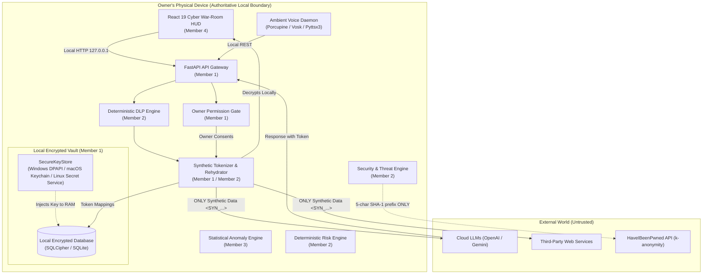
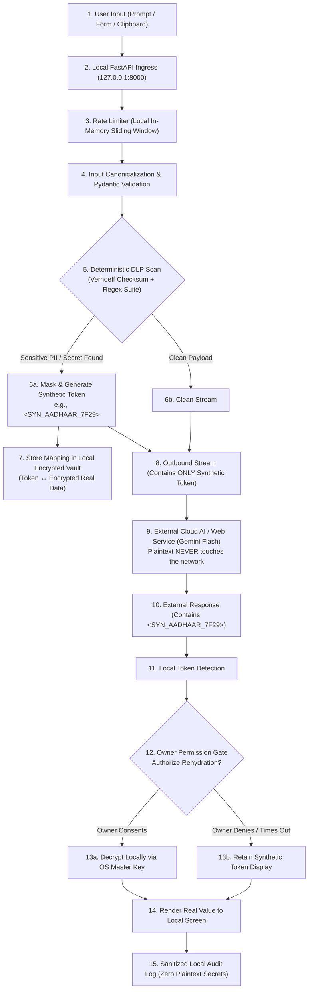
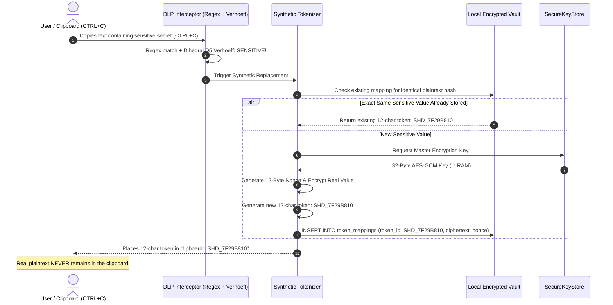
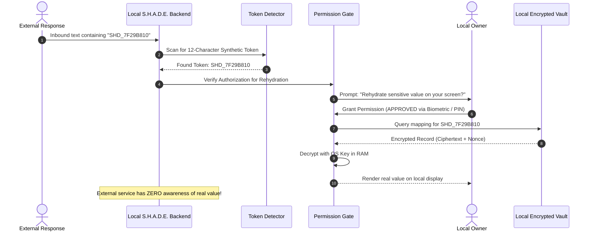
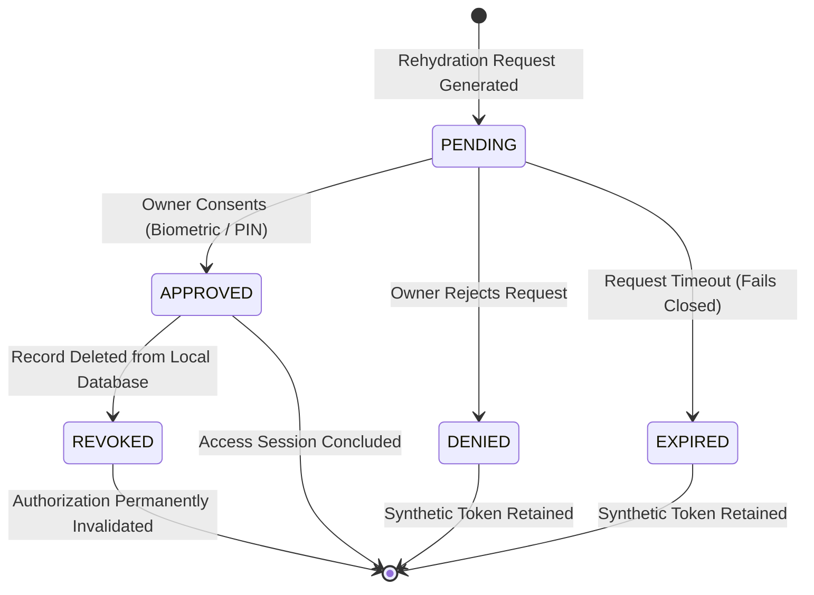
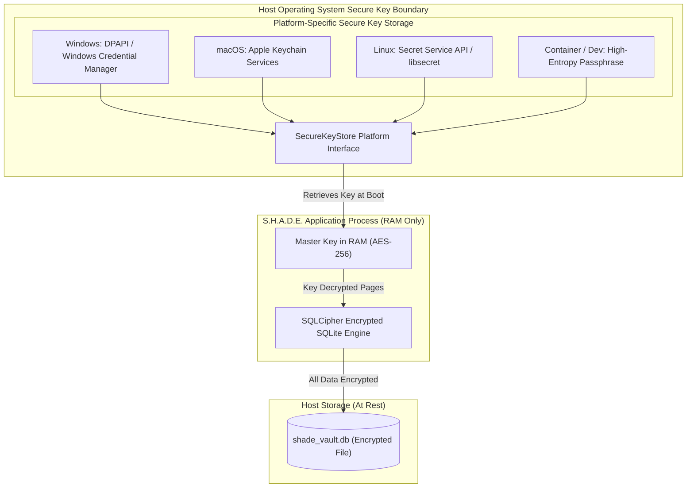
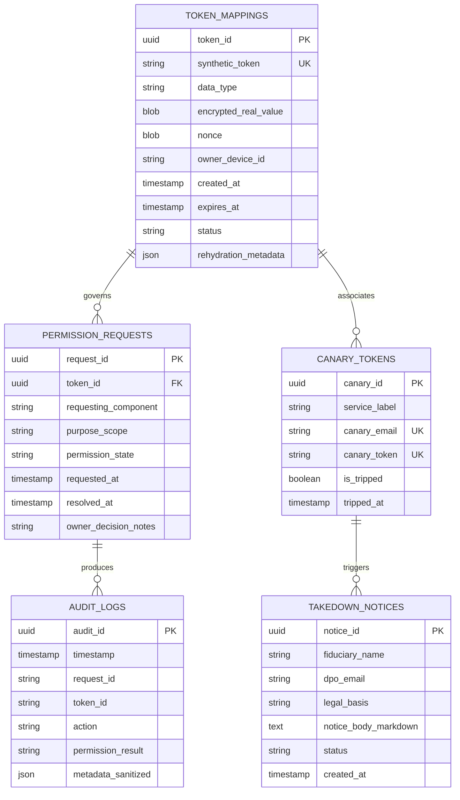

# S.H.A.D.E. — Master Architecture & Secure System Design Blueprint
**Synthetic Host for Automated Data Extractor (Anonymization, Detection & Enforcement)**  
*Document Version: 2.1.0 | Status: APPROVED LOCAL-FIRST ARCHITECTURE BASELINE | Date: October 2026*  
*Repository: Shashank-1920/KPRIET-HackITon26 | Workstream: Shared 4-Member Baseline*

---

## 1. System Overview

**S.H.A.D.E.** (**S**ynthetic **H**ost for **A**utomated **D**ata **E**xtractor) is a **local-first, privacy-first, device-local, security-first** personal security operations center and data cloaking intermediary.

### Core Architecture Axiom: Real Sensitive Data Stays Local
In traditional cloud architectures, user credentials and Personal Identifiable Information (PII) are stored on remote cloud databases, creating centralized breach targets. S.H.A.D.E. inverts this model:
- **Authoritative Store is Device-Local**: The owner's physical computer is the sole authoritative repository for real sensitive data (Aadhaar, PAN, credentials, private keys) and cryptographic token mappings.
- **Local Encrypted Vault**: Sensitive data is persisted strictly inside a device-local encrypted SQLite database (e.g., SQLCipher). S.H.A.D.E. is **not** a cloud database application.
- **Synthetic Tokenization**: External services and third-party cloud LLMs receive **only** synthetic representations (e.g., `<SYN_AADHAAR_7F29>`).
- **Owner Authorization & Local Rehydration**: Rehydrating synthetic tokens back into real data occurs exclusively on the local machine and requires explicit, interactive owner consent.

```
REAL SENSITIVE DATA ──▶ LOCAL S.H.A.D.E. VAULT ──▶ ENCRYPTED LOCAL STORAGE ──▶ SYNTHETIC TOKEN
                                                                                       │
USER ◀── LOCAL REHYDRATION ◀── OWNER PERMISSION ◀── TOKEN DETECTION ◀── SYNTHETIC RESPONSE ◀┘
```

---

## 2. Design Principles

1. **Local-First Authority**: The device owner retains absolute sovereignty over their data.
2. **Least Privilege**: Components receive only the minimum data required for their specific purpose.
3. **Zero-Trust Between Modules**: Every internal and external boundary enforces strict Pydantic v2 schemas.
4. **Deterministic Security Decisions**: High-stakes security actions and PII detection rely on deterministic mathematics (e.g., Dihedral D5 Verhoeff checksums), not probabilistic AI.
5. **Fail-Safe Offline Operation (Venue Wi-Fi Shield)**: The entire core lifecycle executes offline using local encrypted SQLite storage, local heuristics, and local mock datasets.
6. **Data Minimization & Exposure Reduction**: S.H.A.D.E. reduces exposure by keeping real data local and sending synthetic representations externally.

---

## 3. Component Architecture



---

## 4. Repository Ownership

The repository is partitioned into four decoupled workstreams corresponding to the four team members:

| Member | Assigned Role | Primary Git Branch | Directory Ownership | Core Responsibilities |
| :--- | :--- | :--- | :--- | :--- |
| **Member 1** | Core Architecture + Backend + Database + Integration | `member-1/backend` | `backend/`, `docs/`, `docker-compose.yml`, `.env.example` | FastAPI ASGI application, local encrypted database (SQLCipher), `SecureKeyStore` abstraction, token mapping, permission gate, integration contracts. |
| **Member 2** | Security + Threat Engine + Risk Analysis | `member-2/security` | `security/`, `tests/security/` | Deterministic DLP regex, Verhoeff checksums, synthetic token generation, canary honeytokens, HIBP k-anonymity client, 0–100 Exposome Threat Index. |
| **Member 3** | AI/ML + Detection + Anomaly Analysis | `member-3/ai` | `ai/`, `tests/ai/` | Statistical anomaly detection (Z-score), PII density heuristics, prompt injection filtering, DPDP Act 2023 Section 12 legal notice generation (masked data only). |
| **Member 4** | Frontend + UI/UX + User Workflow | `member-4/frontend` | `frontend/`, `voice/`, `tests/frontend/` | React 19 Cyber War-Room HUD, SVG threat gauge, live sandbox, owner approval modal, voice interaction HUD. |
| **Shared** | All Members | `main` | `tests/integration/`, `scripts/`, `README.md` | Baseline integration, cross-module testing, repository setup scripts. |

---

## 5. Data Flow



---

## 6. Tokenization Flow & Clipboard Protection

### 6.1 Clipboard Protection (CTRL + C)
S.H.A.D.E. runs as an installed local application. Clipboard protection is triggered specifically when the user performs:

$$\mathbf{CTRL + C}$$

1. Intercepts copied content locally on the host.
2. Evaluates sensitive-data matchers.
3. **Normal / General Text**: Ignored completely; clipboard left untouched.
4. **Sensitive Data Detected**: Real value encrypted locally; clipboard replaced with an **exactly 12-character synthetic token** (e.g., `SHD_7F29B810`).

### 6.2 Token Specification & Duplicate Reuse Rule
- **Length**: Exactly **12 characters**.
- **Nature**: Synthetic, non-reversible, safe to expose externally.
- **Duplicate Handling**: If the exact same sensitive value is detected again, do **NOT** create a duplicate database record; **reuse** the existing synthetic token and mapping.



---

## 7. Rehydration Flow



---

## 8. Permission Flow, Owner Authorization & Lifetime

### 8.1 Biometric & PIN Fallback
- **REQUEST $\neq$ AUTHORIZATION**: External requests never imply authorization.
- **Biometric Preference**: Fingerprint or Face ID-style device biometric.
- **Fallback**: Device PIN/password if biometric is unavailable.

### 8.2 Authorization Lifetime
Once the owner authorizes access to a sensitive value, the authorization remains valid **until that sensitive-value record is deleted from S.H.A.D.E.'s local database**. Deleting the sensitive-value record immediately invalidates the associated authorization.



### Permission Attributes:
- **Token ID**: Identifies the 12-character synthetic token requested.
- **Requesting Component**: Identifies which client/application requested access.
- **Purpose / Scope**: Documented business justification (e.g., KYC submission).
- **Time Limit**: Strict interactive prompt budget (e.g., 60 seconds).
- **Audit Record**: Every decision generates a sanitized audit log entry.

---

## 9. Secure Key Architecture (`SecureKeyStore`)

Database encryption keys must **never** reside inside the database file or in git commits.



### Key Management Rules:
1. **Zero Key Persistence in Repo**: Keys exist exclusively in the OS keystore and process RAM.
2. **Platform Abstraction**: S.H.A.D.E. defines `SecureKeyStore` with concrete platform adapters for Windows, macOS, and Linux.

---

## 10. Database Architecture

### 10.1 Primary Local Encrypted Vault (SQLCipher)
- **Authoritative Database**: Local embedded **encrypted SQLite** database (SQLCipher / AES-256 encrypted SQLite).
- **Storage Path**: `./data/shade_vault.db` on host disk.
- **Zero Plaintext Storage**: Plaintext sensitive values (Aadhaar, PAN, passwords) are never stored in an unencrypted file.
- **Page-Level Encryption**: 256-bit AES with per-page HMAC-SHA512 tamper verification.

### 10.2 Relational Data Model


### 10.3 PostgreSQL and Redis Decisions
- **PostgreSQL**: **Removed from the primary data vault.** Serves strictly as optional/future auxiliary telemetry sync infrastructure. Never stores plaintext user secrets.
- **Redis**: **Optional ephemeral security state.** Used only for rate-limiting counters when available; defaults to an in-memory sliding-window counter for 100% standalone execution.

---

## 11. DLP & Sensitive Data Scope

### 11.1 Sensitive Data Scope
S.H.A.D.E. protects sensitive identifiers, credentials, and keys:
- **Government IDs**: Aadhaar (Dihedral D5 Verhoeff validated), PAN cards
- **Communication & Identity**: Mobile numbers, email addresses, vehicle number plates
- **Cryptographic & API Secrets**: API keys, access keys, secret keys, passwords, URLs containing secrets
- **Financial Identifiers**: Credit/debit card numbers, UPI IDs
- **Scope Boundary**: Documents (PDFs, scans, files) are **NOT** part of the current sensitive-data scope. The detection suite is extensible to allow future data types.

### 11.2 Deterministic Matching & 12-Character Tokenization
- **Deterministic Matchers**:
  - **Aadhaar**: Regex `\b[2-9][0-9]{3}\s?[0-9]{4}\s?[0-9]{4}\b` verified with the **Dihedral D5 Verhoeff checksum algorithm**. False positives are mathematically rejected locally.
  - **PAN**: Regex `\b[A-Z]{5}[0-9]{4}[A-Z]{1}\b` with entity type character verification.
  - **API Keys / Secrets**: High-entropy token scanners (AWS, GitHub, Slack tokens).
- **Synthetic Replacement**: Matched sensitive values are replaced with an **exactly 12-character synthetic token** (e.g., `SHD_7F29B810`).
- **Reuse Invariant**: If the exact same sensitive value is detected again, S.H.A.D.E. **reuses** the existing 12-character token without creating duplicate database records.

---

## 12. Threat, Risk & Exposure Architecture

Owned by **Member 2** (with Risk Scoring logic by **Member 3**):

### 12.1 Trusted Destinations Policy
- **Trusted Destinations**: Government websites (`*.gov.in`, `*.nic.in`) and college/university websites (`*.ac.in`, `*.edu`) are considered trusted destinations.
- **Untrusted Policy**: Other websites that merely provide publicly accessible or open-source data are **NOT** automatically considered trusted.
- **Invariant**: *"Publicly accessible" does NOT mean "trusted."* Destination trust is strictly governed by policy.

### 12.2 Manual Search & Automatic Monitoring
- **Manual Exposure Search**: The owner can search their own email, mobile number, API key, password, or Aadhaar across exposure dumps.
- **Automatic Exposure Monitoring**: S.H.A.D.E. automatically monitors stored sensitive items in the background for newly discovered exposures without requiring repetitive manual input.

### 12.3 Risk Scoring & Business Classification (0–100)
Member 3's risk engine provides the numeric risk score:
- **Score Range**: `0–100`
- **Business Classifications**:
  - **No exposure** $\rightarrow$ `0`
  - **Low-risk website** $\rightarrow$ `LOW`
  - **Private organization** $\rightarrow$ `MEDIUM`
  - **Public organization** $\rightarrow$ `CRITICAL`
- **Evidence Integrity**: S.H.A.D.E. distinguishes available evidence from unsupported assumptions. It never falsely accuses individuals without verifiable forensic evidence.

### 12.4 Breach Radar (HIBP k-Anonymity Standard)
- Computes local SHA-1 of password.
- Sends only the first 5 characters to `api.pwnedpasswords.com/range/{prefix}`.
- Suffix matching performed locally in memory.
- **Strict Prohibition**: Passwords are never sent plaintext. Aadhaar, PAN, emails, and identity records are **never** transmitted to HIBP.

### 12.5 Statutory Erasure Workflow & Case Management
When an exposure occurs:
1. S.H.A.D.E. prepares a formal erasure request citing the DPDP Act 2023.
2. The user reviews and retains control over sending the request.
3. A **7-day statutory deadline** is monitored.
4. If no response is received, a follow-up request is queued and case status is updated.
5. Case records track: `case_id`, `organization`, `data_type`, `discovery_date`, `evidence`, `risk_score`, `request_date`, `7_day_deadline`, `status`.

---

## 13. AI Architecture

Owned by **Member 3**:
- **Operating Constraint**: Operates **strictly on pre-masked payloads**. Raw Aadhaar, PAN, and credentials never enter AI prompts.
- **Anomaly Detection**: Statistical Z-score outlier detection assessing text length, prompt entropy, and PII frequency spikes.
- **DPDP Act 2023 Section 12 Legal Notice Synthesis**: Generates formal data erasure requisitions citing Section 12(1) and Section 12(2) using Gemini Flash or local Ollama.
- **Advisory Role**: AI analysis is purely informational and cannot independently authorize or override security actions.

---

## 14. Frontend Architecture

Owned by **Member 4**:
- **Stack**: React 19, Vite, Vanilla CSS, Lucide React.
- **Cyber War-Room HUD**: Dark-mode glassmorphic interface displaying real-time security posture.
- **SVG Exposome Threat Meter**: High-performance SVG gauge reflecting the 0–100 threat index.
- **Live Sandbox**: Interactive testing console demonstrating real-time DLP prompt interception.
- **Owner Approval Modal**: Clean dialog prompting the owner to grant or deny rehydration requests.
- **Constraint**: Communicates strictly via `/api/v1/` and never accesses the local SQLite database directly.

---

## 15. Voice Architecture (Planned)

- **Engine**: Offline Picovoice Porcupine ("Hey Shade") + Vosk STT + Pyttsx3 TTS.
- **Transport**: Issues local REST requests to `127.0.0.1:8000/api/v1/`.
- **Auditorium Failover**: Includes an on-screen simulation HUD in the frontend for 1-click execution in noisy presentation venues.

---

## 16. API Boundaries & Contracts

All endpoints are versioned under `/api/v1/` and governed by strict Pydantic v2 schemas:

```python
from pydantic import BaseModel, Field
from typing import Optional, List
from datetime import datetime

class TokenCreateRequest(BaseModel):
    data_type: str = Field(..., description="AADHAAR, PAN, API_KEY, PASSWORD")
    raw_sensitive_value: str = Field(..., min_length=1)
    rehydration_metadata: Optional[dict] = None

class TokenCreateResponse(BaseModel):
    token_id: str
    synthetic_token: str
    data_type: str
    created_at: datetime

class RehydrationRequest(BaseModel):
    synthetic_token: str
    requesting_component: str
    purpose_scope: str

class RehydrationResponse(BaseModel):
    synthetic_token: str
    permission_state: str = Field(..., description="PENDING, APPROVED, DENIED, EXPIRED")
    rehydrated_value: Optional[str] = None
    audit_id: str
```

---

## 17. Security Boundaries & Zone Classification

```
┌────────────────────────────────────────────────────────────────────────┐
│ ZONE 1: REAL SENSITIVE DATA (HIGHEST PROTECTION)                        │
│ • Plaintext Aadhaar, PAN, Passwords, Encryption Keys                   │
│ • Exists in Host RAM only during active encryption/decryption          │
├────────────────────────────────────────────────────────────────────────┤
│ ZONE 2: ENCRYPTED LOCAL STORAGE (SQLCIPHER VAULT)                      │
│ • Device-local shade_vault.db file protected by AES-256 page cipher    │
│ • Accessible only via SecureKeyStore-injected master key               │
├────────────────────────────────────────────────────────────────────────┤
│ ZONE 3: PERMISSION & AUDIT METADATA                                    │
│ • Request IDs, component identifiers, consent timestamps               │
│ • Sanitized audit logs with raw secrets strictly redacted              │
├────────────────────────────────────────────────────────────────────────┤
│ ZONE 4: SYNTHETIC DATA (CONTROLLED EXPOSURE)                           │
│ • <SYN_AADHAAR_7F29>, synthetic email addresses, decoy honeytokens     │
│ • Safe for transmission to external web services and cloud LLMs        │
├────────────────────────────────────────────────────────────────────────┤
│ ZONE 5: EXTERNAL AI / CLOUD SERVICES (UNTRUSTED)                       │
│ • Google Gemini, third-party APIs, external websites                   │
│ • Receives ONLY Zone 4 synthetic tokens                                │
└────────────────────────────────────────────────────────────────────────┘
```

---

## 18. Audit Architecture

Every rehydration request, token generation, and DLP event produces an immutable local audit record:
- **Logged Attributes**: `timestamp`, `request_id`, `token_id`, `action`, `permission_result`, `requesting_component`.
- **Prohibited Attributes**: **Never** store plaintext Aadhaar numbers, PAN cards, passwords, or cryptographic keys.
- **Example**:
  - `GOOD`: `{"token_id": "SYN_AADHAAR_7F29", "action": "REHYDRATE", "result": "APPROVED", "component": "web_sandbox"}`
  - `BAD`: `{"aadhaar": "266853339452", "action": "REHYDRATE"}`

---

## 19. Error Handling

- **RFC 7807 Format**: All API errors emit structured JSON error details.
- **Information Masking**: Stack traces, SQL statements, and internal file paths are stripped before client response emission.

---

## 20. Testing Strategy

Organized into five decoupled test directories under `tests/`:
- `tests/backend/`: Member 1 tests (FastAPI routes, SQLite vault, `SecureKeyStore` mock, permission state machine).
- `tests/security/`: Member 2 tests (Dihedral D5 Verhoeff checksum calculation, Indian PAN regex, HIBP k-anonymity queries).
- `tests/ai/`: Member 3 tests (Statistical anomaly scoring, Z-score thresholds, DPDP notice template formatting).
- `tests/frontend/`: Member 4 tests (React component rendering, SVG threat meter display).
- `tests/integration/`: Shared end-to-end tests (DLP $\rightarrow$ Tokenize $\rightarrow$ External Roundtrip $\rightarrow$ Permission $\rightarrow$ Rehydration).

---

## 21. Deployment Strategy

- **Local Execution (Default)**: Standalone Python process running FastAPI on `127.0.0.1:8000` with local encrypted SQLite file on host disk.
- **Containerized Execution (`docker-compose.yml`)**:
  - `backend`: FastAPI service mounting local host volume for `shade_vault.db`.
  - `frontend`: React 19 / Vite build served via Nginx on `127.0.0.1:3000`.
  - `cache`: Optional Redis service (activated only via `--profile distributed-cache`).

---

## 22. Team Integration Rules

1. **Rule 1 (Inspect Before Edit)**: Always inspect git status and existing implementations before modifying files.
2. **Rule 2 (No Direct Push to `main`)**: All development occurs on dedicated member branches (`member-1/backend`, `member-2/security`, `member-3/ai`, `member-4/frontend`).
3. **Rule 3 (Never Force Push)**: `git push --force` is strictly forbidden to preserve shared repository history.
4. **Rule 4 (No Plaintext Secrets)**: Never commit `.env`, passwords, private keys, or API tokens.
5. **Rule 5 (Deterministic Authority)**: AI/ML models never independently authorize sensitive actions.
6. **Rule 6 (Fail-Safe Offline Mode)**: Every cloud API integration must have an instant local mock fallback for hackathon venue resilience.
