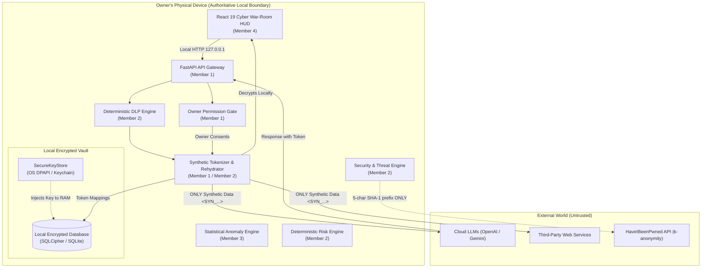
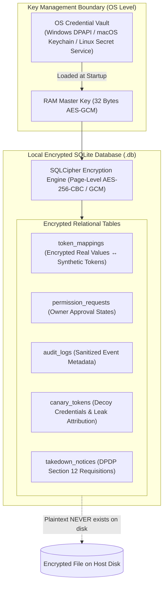
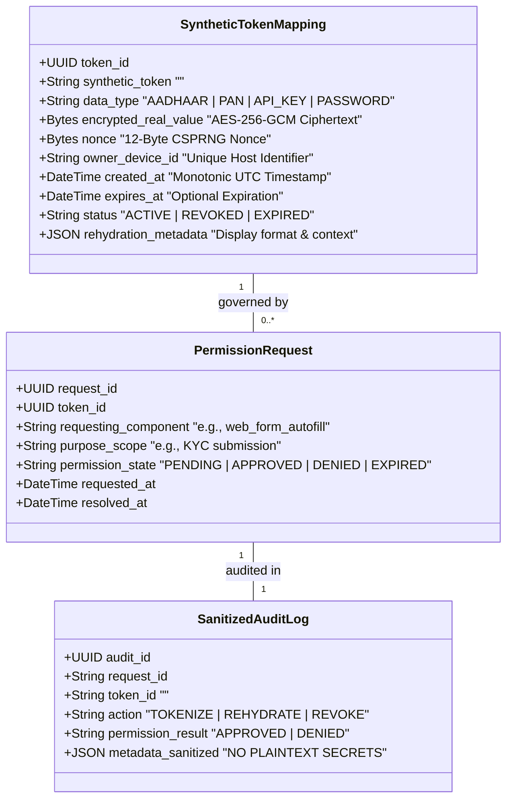
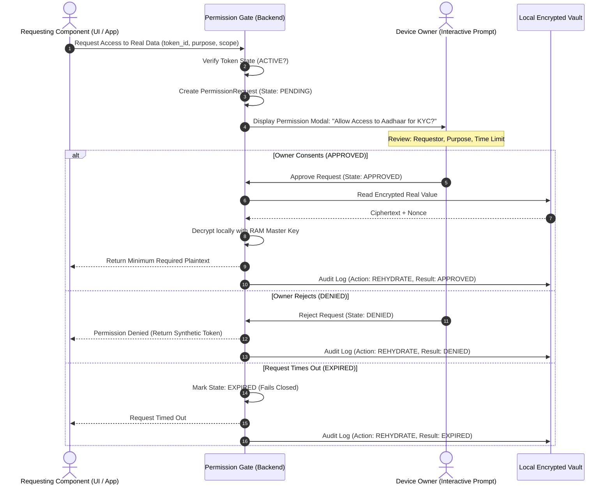
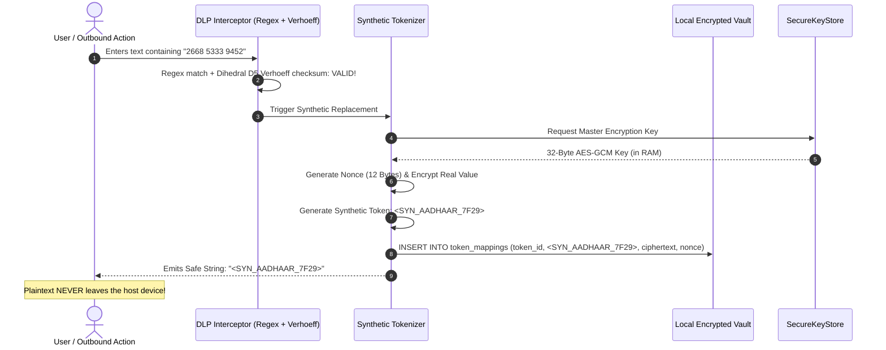
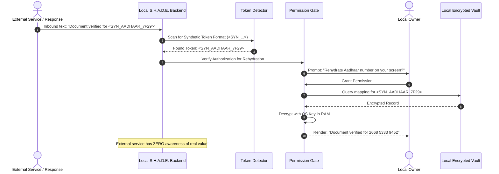
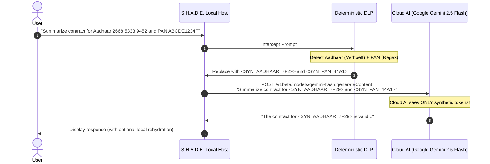
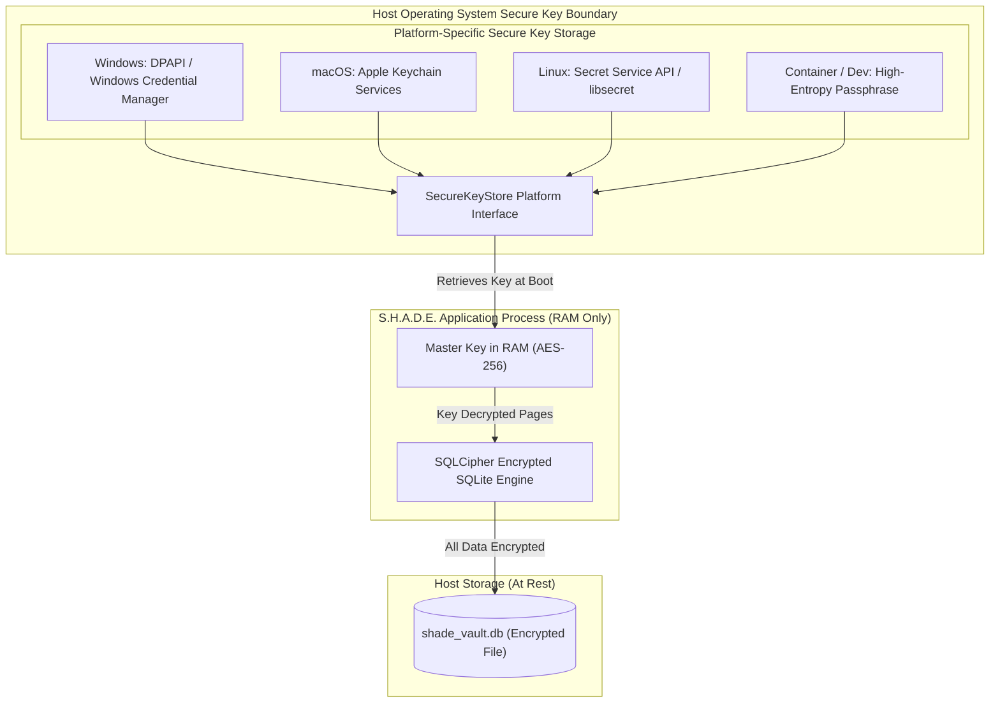

# S.H.A.D.E. — Master Architecture & Secure System Design Blueprint
**Synthetic Host for Anonymization, Detection & Enforcement**  
*Document Version: 2.0.0 | Status: LOCAL-FIRST PRIVACY BLUEPRINT | Date: October 2026*  
*Repository: Shashank-1920/KPRIET-HackITon26 | Workstream: Member 1 (Core Architecture + Backend + Database + Integration)*

---

## 1. Project Overview & Core Philosophy

**S.H.A.D.E.** (**S**ynthetic **H**ost for **A**nonymization, **D**etection & **E**nforcement) is fundamentally a:
- **LOCAL-FIRST**
- **PRIVACY-FIRST**
- **DEVICE-LOCAL**
- **SECURITY-FIRST**

personal security operations center and data cloaking vault.

### Core Architectural Principle: Real Sensitive Data Stays Local
In traditional architectures, user credentials and PII are uploaded to centralized cloud databases, creating single points of failure and massive breach liability. S.H.A.D.E. rejects this paradigm.

**The owner's physical device is the authoritative location for the user's sensitive real data and its cryptographic synthetic mappings.** S.H.A.D.E. is **not** a cloud database application. Real sensitive values (Aadhaar numbers, PAN cards, passwords, private keys) are persisted strictly inside an **encrypted, device-local SQLite database** (e.g., SQLCipher). External services and cloud LLMs receive **only** synthetic representations (e.g., `<SYN_AADHAAR_7F29>`). Rehydrating synthetic tokens back into real data is performed exclusively on the local machine and requires explicit, interactive owner authorization.

S.H.A.D.E. implements a 5-phase defense lifecycle:
1. **PREVENT (Real-Time DLP)**: Deterministic client/edge interception replacing PII and secrets with synthetic tokens (`<SYN_AADHAAR_xxxx>`) before data leaves the host.
2. **DETECT (Data Extractor & Breach Radar)**: Local privacy-preserving k-anonymity breach detection and broker surveillance calculating a dynamic 0–100 Exposome Threat Index.
3. **CLOAK (Synthetic Host & Honey-Tokens)**: Autonomous decoy credentials and trackable canary tokens establishing cryptographic leak attribution when third parties suffer breaches.
4. **ENFORCE (Statutory Takedown)**: Automated DPDP Act 2023 Section 12 legal notice synthesis, compiling structured fiduciary complaints for 1-click legal dispatch.
5. **INTERACTION (Ambient War-Room HUD & Voice)**: Cyberpunk-styled operations dashboard with owner permission controls and offline failover guarantees.

---

## 2. Architecture Goals

- **Device-Authoritative Persistence**: The user's device is the authoritative source of truth. No central server or cloud database stores the user's real plaintext records.
- **Zero-Trust Between Modules**: Every internal and external service communication validates schemas, enforces least privilege, and canonicalizes inputs.
- **Deterministic-First Security**: Critical security decisions, PII tokenization, and credential validation rely on deterministic, explainable mathematical rules (e.g., Verhoeff checksums, regex state machines) rather than probabilistic AI models.
- **Owner-Controlled Permission Gate**: Rehydration of synthetic tokens to real data requires explicit, granular, time-limited owner consent.
- **Fail-Safe & Resilient (Venue Wi-Fi Shield)**: The system operates 100% offline using local encrypted SQLite storage, local regex rules, and local mock datasets.
- **Sub-15ms Edge Interception**: DLP evaluation and tokenization pipelines execute within <15ms to allow real-time prompt/clipboard filtering without user friction.

---

## 3. Security Goals & Exposure Reduction

> **Important Security Principle**: S.H.A.D.E. does not claim "unbreakable" encryption or "zero risk." Rather, S.H.A.D.E. mathematically and architecturally **reduces exposure** by ensuring real sensitive data remains local and encrypted, while only synthetic representations are exposed externally.

- **Confidentiality**: Plaintext PII, raw passwords, secret keys, and database encryption keys never traverse untrusted network boundaries or appear in logs.
- **Integrity**: Every transaction, event, and audit record maintains tamper-evident integrity using monotonic timestamps, UUIDv7 identifiers, and HMAC-SHA256 signatures.
- **Availability**: System resources are shielded against denial-of-service, algorithmic complexity attacks, and brute-force enumeration via sliding-window rate limiting.
- **Data Minimization (Privacy by Design)**: Collect only what is mathematically necessary. If an identifier does not need to be stored, it is discarded immediately after verification.
- **Auditability Without Leaks**: Comprehensive structured security event auditing that logs sanitization metadata and token references while strictly redacting raw sensitive payloads.

---

## 4. Final Security-First Technology Stack

| Layer | Target Technology | Version | Role & Justification in S.H.A.D.E. |
| :--- | :--- | :--- | :--- |
| **Frontend UI/UX** | React + Vite | 19.x / 6.x | High-performance reactive War-Room HUD, permission approval modal, zero bloat. |
| **Frontend Styling** | Vanilla CSS | CSS3 / Custom Variables | Dark-mode glassmorphic cyberpunk styling, pixel-perfect control, zero framework lock-in. |
| **Frontend Icons** | Lucide React | Latest | Clean, lightweight SVG iconography for SOC threat meters and alert cards. |
| **Backend Framework** | Python + FastAPI | 3.12+ / 0.136+ | Asynchronous ASGI runtime, native Pydantic v2 schema enforcement, sub-millisecond routing. |
| **ASGI Server** | Uvicorn | 0.34+ | Production-grade asynchronous HTTP/1.1 and WebSocket server. |
| **HTTP Client** | HTTPX | 0.28+ | Async HTTP client configured with strict timeout budgets and destination allowlists. |
| **Data Validation** | Pydantic | 2.10+ | Strict type validation, serialization, and contract verification across all boundaries. |
| **Primary Data Vault** | **Encrypted SQLite (SQLCipher)** | 3.45+ / 4.x | **Authoritative local encrypted database.** Stores encrypted real values and synthetic mappings locally. Zero cloud DB dependency. |
| **Key Storage Boundary**| **SecureKeyStore Abstraction** | Native OS APIs | Platform-native secure key storage: Windows DPAPI, macOS Keychain, Linux Secret Service. |
| **ORM & Persistence** | SQLAlchemy | 2.0+ | Async ORM mappings, typed queries, parameterization, and local schema management. |
| **Ephemeral State** | In-Memory / Optional Redis | 7.x (Optional) | Rate limiting and replay protection. Defaults to in-memory sliding-window; Redis is optional. |
| **Password Hashing** | Argon2id (`argon2-cffi`)| 23.x | Memory-hard, timing-attack-resistant modern password hashing standard (never SHA-256). |
| **Cryptography** | `cryptography` (AES-256-GCM)| 43.x | Authenticated encryption for persistent sensitive vaults using CSPRNG nonces. |
| **DLP & Checksums** | Python `re` + Verhoeff Engine | Native StdLib | Mathematically exact Indian Aadhaar, PAN, and secret-key deterministic interception. |
| **Breach Intelligence**| HIBP Passwords API v3 | REST (k-anonymity) | Privacy-preserving password exposure queries using 5-character SHA-1 hash prefixes only. |
| **AI / Legal Engine** | Google Gemini 2.5 Flash / Ollama | Flash / Phi-3 | Structured DPDP Act Section 12 legal takedown drafting (operates strictly on masked data). |
| **Testing** | Pytest + pytest-asyncio | 8.x / 0.24+ | Comprehensive asynchronous unit, integration, and security fuzzing test execution. |

---

## 5. Required Architectural Diagrams

### Diagram 1: Local-First S.H.A.D.E. Architecture


---

### Diagram 2: Local Encrypted Data Vault


---

### Diagram 3: Synthetic Token ↔ Encrypted Real-Data Mapping


---

### Diagram 4: Permission / Owner Authorization Flow


---

### Diagram 5: Tokenization Flow


---

### Diagram 6: Local Rehydration Flow


---

### Diagram 7: External AI Safe-Transmission Flow


---

### Diagram 8: Secure Key-Storage Boundary


---

### Diagram 9: Complete Repository Architecture

```mermaid
graph TD
    subgraph Root["KPRIET-HackITon26 / (Git Branch: member-1/backend)"]
        subgraph M1["MEMBER 1: Core Architecture + Backend + Local Vault"]
            B1["backend/api/ (Routes & Auth Guards)"]
            B2["backend/database/ (Local Encrypted SQLite)"]
            B3["backend/keystore/ (SecureKeyStore Abstraction)"]
            B4["backend/models/ (token_mapping.py, permission.py)"]
            B5["backend/schemas/ (Pydantic v2 Contracts)"]
            B6["backend/main.py (FastAPI App)"]
        end

        subgraph M2["MEMBER 2: Security + Threat Engine + Risk Analysis"]
            S1["security/dlp/ (Regex Suite & Tokenizer)"]
            S2["security/validators/ (Verhoeff Checksum)"]
            S3["security/threat_engine/ (Canaries & Breach Rules)"]
            S4["security/risk_engine/ (0-100 Exposome Threat Index)"]
            S5["security/breach_radar/ (HIBP k-Anonymity)"]
        end

        subgraph M3["MEMBER 3: AI/ML + Detection + Anomaly Analysis"]
            A1["ai/anomaly/ (Statistical Z-Score Outlier Engine)"]
            A2["ai/heuristics/ (PII Density & Prompt Filters)"]
            A3["ai/legal/ (DPDP Act Section 12 Drafter)"]
            A4["ai/templates/ (Statutory Markdown Templates)"]
        end

        subgraph M4["MEMBER 4: Frontend + UI/UX + User Workflow"]
            F1["frontend/src/components/ (ThreatMeter, Sandbox, ApprovalModal)"]
            F2["frontend/src/pages/ (Dashboard, BreachRadar, AuditLogs)"]
            F3["frontend/src/services/ (api.js - Consumes /api/v1/)"]
        end

        subgraph Shared["Shared & Auxiliary"]
            V1["voice/ (Planned Ambient Audio HUD)"]
            T1["tests/ (Decoupled Pytest Suites)"]
            D1["docs/architecture/ (ARCHITECTURE.md, REPOSITORY_STRUCTURE.md)"]
            C1[".env.example, docker-compose.yml, README.md"]
        end
    end

    M4 -->|REST API Only| M1
    M1 --> M2
    M1 --> M3
```


---

### Diagram 10: Deployment Architecture (Local-First Containerized / Native)
```mermaid
flowchart LR
    subgraph HostSystem["Host System (User Machine)"]
        UserBrowser["Web Browser (Localhost:3000)"]
        
        subgraph LocalDocker["Local Docker Compose / Native Process"]
            FrontendSvc["Frontend Container<br/>(React 19 / Nginx :3000)"]
            BackendSvc["Backend Container<br/>(FastAPI / Uvicorn :8000)"]
            LocalVol[("Host Volume Mount<br/>/app/data/shade_vault.db")]
        end
        
        HostKeystore["Host OS Keystore<br/>(Windows DPAPI / Keychain)"]
    end

    UserBrowser -->|HTTP| FrontendSvc
    FrontendSvc -->|Proxy /api/v1| BackendSvc
    BackendSvc --> LocalVol
    HostKeystore -.->|Supplies Key| BackendSvc
    BackendSvc -.->|k-Anonymity Only (5-char hash)| HIBP["External HIBP API"]
    BackendSvc -.->|Synthetic Prompts Only| Gemini["External Gemini API"]
```

---

## 6. Local Encrypted Database Architecture

### 6.1 Database Engine: Encrypted SQLite (SQLCipher)
S.H.A.D.E. uses an embedded **encrypted SQLite** database as its primary authoritative data store:
- **Engine**: SQLite 3 with SQLCipher extension (page-level 256-bit AES encryption with HMAC-SHA512 per page).
- **Driver**: `aiosqlite` with SQLCipher pragmas (`PRAGMA key`, `PRAGMA cipher_page_size = 4096`, `PRAGMA kdf_iter = 256000`).
- **Data at Rest**: Entire database file (`shade_vault.db`) is encrypted on disk. If stolen, raw file analysis yields random ciphertext.
- **Connection Isolation**: Concurrency managed via async connection pooling with `WAL` (Write-Ahead Logging) mode enabled.

### 6.2 Relational Entities in the Local Vault
1. `token_mappings`: Persistent registry connecting `<SYN_...>` placeholders to encrypted real values.
2. `permission_requests`: Granular audit of every owner authorization request.
3. `audit_logs`: Tamper-evident forensic records of system events (strictly redacting real secrets).
4. `canary_tokens`: Decoy identities and tripwire records.
5. `takedown_notices`: DPDP Act 2023 Section 12 notice drafts.

---

## 7. Cryptographic Key Storage Boundary (`SecureKeyStore`)

The encryption key for the local database must **never** be stored inside the database file or committed in source code.

### 7.1 Platform Abstraction Architecture
```python
from abc import ABC, abstractmethod

class SecureKeyStore(ABC):
    @abstractmethod
    def get_database_key(self) -> bytes:
        """Retrieve the 32-byte database encryption key from OS secure storage."""
        pass

    @abstractmethod
    def store_database_key(self, key: bytes) -> bool:
        """Persist a newly generated database key in OS secure storage."""
        pass
```

### 7.2 Platform Adapters
- **Windows**: Implemented via `CryptProtectData` / `CryptUnprotectData` (Windows Data Protection API - DPAPI) or Windows Credential Manager.
- **macOS**: Implemented via Apple Keychain Services (`security` CLI / `SecKeychain` C-APIs).
- **Linux**: Implemented via the Secret Service API (`org.freedesktop.secrets` / `libsecret`).
- **Development / Container Fallback**: High-entropy passphrase passed via environment variable `SHADE_MASTER_ENCRYPTION_KEY` with strict permission warnings.

---

## 8. Data Classification & Security Boundary Hierarchy

```
┌────────────────────────────────────────────────────────────────────────┐
│ LEVEL 1: HIGHEST PROTECTION — KEYS & PASSWORDS                         │
│ • Database Encryption Key, Master AES-GCM Key, JWT Secret             │
│ • Stored exclusively in OS Keychain (DPAPI / Keychain / Secret Service)│
├────────────────────────────────────────────────────────────────────────┤
│ LEVEL 2: HIGH PROTECTION — ENCRYPTED REAL DATA                         │
│ • Real Aadhaar, PAN, Passwords, API Keys, Session Secrets              │
│ • Encrypted at rest in Local SQLite via SQLCipher                      │
│ • Accessible ONLY via explicit owner permission                        │
├────────────────────────────────────────────────────────────────────────┤
│ LEVEL 3: MEDIUM PROTECTION — PERMISSION & AUDIT METADATA               │
│ • Permission state records, request IDs, component labels             │
│ • Sanitized audit logs (strictly redacting raw secrets)                │
├────────────────────────────────────────────────────────────────────────┤
│ LEVEL 4: CONTROLLED EXPOSURE — SYNTHETIC DATA                          │
│ • <SYN_AADHAAR_7F29>, <SYN_PAN_44A1>, Synthetic emails                 │
│ • Safe for transmission to external cloud AI and third-party web forms │
└────────────────────────────────────────────────────────────────────────┘
```

---

## 9. Status of PostgreSQL and Redis

### PostgreSQL Decision
- **Core Role**: **Removed from the primary data vault architecture.**
- **Classification**: S.H.A.D.E. does not require PostgreSQL to execute. If a future multi-device telemetry synchronization feature is introduced, PostgreSQL may serve as an optional secondary synchronization target, but it will **never** store plaintext user secrets.

### Redis Decision
- **Core Role**: **Optional ephemeral security state.**
- **Classification**: Used only for temporary sliding-window rate limiting and replay prevention. S.H.A.D.E. includes an in-memory sliding-window counter fallback, allowing complete zero-dependency operation on standard laptops without running Redis.

---

## 10. Breach Radar (HIBP k-Anonymity Standard)

Password exposure verification strictly protects user privacy via the SHA-1 k-anonymity protocol:
1. Compute local SHA-1: `h = hashlib.sha1(password.encode()).hexdigest().upper()`
2. Extract prefix: `prefix = h[:5]` (5 characters)
3. Extract suffix: `suffix = h[5:]` (35 characters)
4. Dispatch GET request: `https://api.pwnedpasswords.com/range/{prefix}`
5. Search response text for matching `suffix:count`.
6. **Strict Prohibition**: Neither raw passwords nor identity data (Aadhaar, PAN, email) is ever dispatched to HIBP.

---

## 11. Structured Logging & Audit Standards

Structured logs are emitted in JSON format to stdout. The custom logging filter automatically sanitizes all log events before output:

```json
{
  "timestamp": "2026-10-08T15:55:10.124Z",
  "level": "INFO",
  "request_id": "req_01j9x7k5v4e7bm9a8q",
  "token_id": "SYN_AADHAAR_7F29",
  "action": "REHYDRATE",
  "permission_result": "APPROVED",
  "requesting_component": "kyc_portal_autofill",
  "details": {
    "item_type": "AADHAAR_CARD",
    "token_assigned": "<SYN_AADHAAR_7F29>",
    "redacted_preview": "********9452"
  }
}
```

**Logging Redaction Rule**: Raw 12-digit Aadhaar numbers, 10-character PANs, raw passwords, and JWT tokens are matched by an output stream filter and transformed into `********[LAST4]` or suppressed entirely. Plaintext secrets are strictly prohibited from audit logs.

---

## 12. Integration Contracts (Pydantic v2 Schemas)

### 12.1 Token Mapping Contract (Member 1)
```python
from pydantic import BaseModel, Field
from typing import Optional
from datetime import datetime

class TokenCreateRequest(BaseModel):
    data_type: str = Field(..., description="AADHAAR, PAN, API_KEY, PASSWORD")
    raw_sensitive_value: str = Field(..., min_length=1)
    rehydration_metadata: Optional[dict] = None

class TokenCreateResponse(BaseModel):
    token_id: str
    synthetic_token: str = Field(..., description="<SYN_AADHAAR_7F29>")
    data_type: str
    created_at: datetime

class RehydrationRequest(BaseModel):
    synthetic_token: str
    requesting_component: str
    purpose_scope: str

class RehydrationResponse(BaseModel):
    synthetic_token: str
    permission_state: str = Field(..., description="PENDING, APPROVED, DENIED, EXPIRED")
    rehydrated_value: Optional[str] = None
    audit_id: str
```

### 12.2 DLP Inspection Contract (Member 2)
```python
from typing import List

class DLPInspectionRequest(BaseModel):
    raw_content: str = Field(..., min_length=1, max_length=50000)
    source_context: str = Field(default="prompt")

class DLPDetectionItem(BaseModel):
    item_type: str
    synthetic_token: str
    redacted_preview: str

class DLPInspectionResponse(BaseModel):
    is_clean: bool
    sanitized_content: str
    detections: List[DLPDetectionItem]
    scan_duration_ms: float
```

### 12.3 Anomaly & Legal Synthesis Contract (Member 3)
```python
class AnomalyEvaluationRequest(BaseModel):
    content_length: int
    pii_density: float
    request_frequency: float

class AnomalyEvaluationResponse(BaseModel):
    anomaly_score: float = Field(..., ge=0.0, le=1.0)
    is_anomalous: bool
    heuristic_notes: List[str]

class DPDPNoticeDraftRequest(BaseModel):
    fiduciary_name: str
    dpo_email: Optional[str] = None
    violation_context: str
    user_pseudonym: str

class DPDPNoticeDraftResponse(BaseModel):
    fiduciary_name: str
    legal_basis: str
    notice_body_markdown: str
    dispatch_ready: bool
```

---

## 13. Team Ownership & Branch Mapping

| Role | Member | Primary Git Branch | Dedicated Ownership Directory |
| :--- | :--- | :--- | :--- |
| **Core Architecture & Integration** | **Member 1** | `member-1/backend` | `backend/core/`, `backend/database/`, `backend/keystore/`, `backend/models/`, `backend/schemas/`, `backend/api/routes/`, `docs/` |
| **Security & Threat Engine** | **Member 2** | `member-2/security` | `security/dlp/`, `security/validators/`, `security/threat_engine/`, `security/risk_engine/`, `security/breach_radar/`, `tests/security/` |
| **AI/ML & Anomaly Analysis** | **Member 3** | `member-3/ai` | `ai/anomaly/`, `ai/heuristics/`, `ai/legal/`, `ai/templates/`, `tests/ai/` |
| **Frontend & User Workflow** | **Member 4** | `member-4/frontend` | `frontend/`, `voice/`, `tests/frontend/` |
