# S.H.A.D.E. — Master Architecture & Secure System Design Blueprint
**Synthetic Host for Anonymization, Detection & Enforcement**  
*Document Version: 1.0.0 | Status: APPROVED BASELINE | Date: October 2026*  
*Repository: Shashank-1920/KPRIET-HackITon26 | Workstream: Member 1 (Core Architecture + Backend + Database + Integration)*

---

## 1. Project Overview

**S.H.A.D.E.** (**S**ynthetic **H**ost for **A**nonymization, **D**etection & **E**nforcement) is a privacy-first, zero-trust Personal Autonomous Counter-Intelligence & Security Operations Center (SOC). 

In modern digital workflows, users frequently leak high-sensitivity Personal Identifiable Information (PII) — such as 12-digit Indian Aadhaar numbers, Permanent Account Numbers (PAN), cloud API credentials, and corporate secrets — into third-party Large Language Models (LLMs), web forms, and cloud services. Simultaneously, commercial data brokers compile unauthorized digital shadow profiles without verifiable attribution, and statutory privacy mandates (specifically the Indian **Digital Personal Data Protection Act 2023 [DPDP Act 2023]**) remain underutilized because ordinary citizens lack automated tooling to detect exposures or enforce Section 12 erasure requisitions.

S.H.A.D.E. solves this crisis by deploying a 5-phase defense lifecycle:
1. **PREVENT (Real-Time DLP)**: Deterministic client/edge interception replacing PII and secrets with cryptographic synthetic tokens (`<SYN_AADHAAR_xxxx>`) before data leaves the host.
2. **DETECT (Data Extractor & Breach Radar)**: Local privacy-preserving k-anonymity breach detection and broker surveillance calculating a dynamic 0–100 Exposome Threat Index.
3. **CLOAK (Synthetic Host & Honey-Tokens)**: Autonomous decoy credentials and trackable canary tokens establishing cryptographic leak attribution when third-party fiduciaries suffer data breaches.
4. **ENFORCE (Statutory Takedown)**: Automated DPDP Act 2023 Section 12 legal notice synthesis, compiling structured fiduciary complaints for 1-click legal dispatch.
5. **INTERACTION (Ambient War-Room HUD & Voice)**: Cyberpunk-styled operations dashboard and local voice HUD with seamless offline failover guarantees.

---

## 2. Architecture Goals

- **Zero-Trust Between Modules**: Every internal and external service communication must validate schemas, enforce least privilege, and sanitize inputs. No module blindly trusts data from another.
- **Deterministic-First Security**: Critical security decisions, PII tokenization, and credential validation must rely on deterministic, explainable mathematical rules (e.g., Verhoeff checksums, regex state machines) rather than probabilistic AI models.
- **Fail-Safe & Resilient (Venue Wi-Fi Shield)**: In the event of network disruption or cloud API downtime, the system must gracefully degrade to local cached datasets and rule-based heuristics without crashing.
- **Sub-15ms Edge Interception**: DLP evaluation and tokenization pipelines must execute within <15ms to allow real-time prompt/clipboard filtering without noticeable user friction.
- **Clean 4-Member Workstream Separation**: Strict interface decoupling via Pydantic v2 API contracts, allowing 4 developers to work concurrently on dedicated branches (`member-1/backend`, `member-2/security`, `member-3/ai`, `member-4/frontend`) without merge collisions.

---

## 3. Security Goals

- **Confidentiality**: Plaintext PII, raw passwords, secret keys, and database credentials must never traverse untrusted network boundaries or appear in logs.
- **Integrity**: Every transaction, event, and audit record must maintain tamper-evident integrity using monotonic timestamps, UUIDv7 identifiers, and HMAC-SHA256 signatures where state persistence is required.
- **Availability**: System resources are shielded against denial-of-service, algorithmic complexity attacks, and brute-force enumeration via Redis-backed sliding-window rate limiting.
- **Data Minimization (Privacy by Design)**: Collect only what is mathematically necessary. If an identifier does not need to be stored, it is discarded immediately after verification.
- **Auditability Without Leaks**: Comprehensive structured security event auditing that logs sanitization metadata and token references while strictly redacting raw sensitive payloads.

---

## 4. Final Technology Stack

| Layer | Target Technology | Version | Justification & Role in S.H.A.D.E. |
| :--- | :--- | :--- | :--- |
| **Frontend UI/UX** | React + Vite | 19.x / 6.x | High-performance reactive War-Room HUD, cybernetic state visualization, zero bloat. |
| **Frontend Styling** | Vanilla CSS | CSS3 / Custom Variables | Pixel-perfect cyberpunk aesthetics, dark-mode glassmorphism, zero framework lock-in. |
| **Frontend Icons** | Lucide React | Latest | Clean, lightweight SVG iconography for SOC threat meters and alert cards. |
| **Backend Framework** | Python + FastAPI | 3.12+ / 0.136+ | Asynchronous ASGI runtime, native Pydantic v2 schema enforcement, sub-millisecond routing. |
| **ASGI Server** | Uvicorn | 0.34+ | Production-grade asynchronous HTTP/1.1 and WebSocket server. |
| **HTTP Client** | HTTPX | 0.28+ | Async HTTP client configured with strict timeout budgets and destination allowlists. |
| **Data Validation** | Pydantic | 2.10+ | Strict type validation, serialization, and contract verification across all boundaries. |
| **Primary Database** | PostgreSQL / SQLite Fallback | 16+ / 3.45+ | Relational integrity, ACID transactions, JSONB audit queries. SQLite provides zero-config offline demo resilience. |
| **ORM & Migrations**| SQLAlchemy + Alembic | 2.0+ / 1.14+ | Async ORM mappings, typed queries, parameterization, and controlled schema versioning. |
| **Cache & Throttling**| Redis | 7.x / In-Memory Mock | Low-latency sliding-window rate limiting, replay attack prevention, and session state. |
| **Password Hashing** | Argon2id (`argon2-cffi`)| 23.x | Memory-hard, timing-attack-resistant modern password hashing standard (never SHA-256). |
| **Cryptography** | `cryptography` (AES-256-GCM)| 43.x | Authenticated encryption for persistent sensitive vaults using CSPRNG nonces. |
| **DLP & Checksums** | Python `re` + Verhoeff Engine | Native StdLib | Mathematically exact Indian Aadhaar, PAN, and secret-key deterministic interception. |
| **Breach Intelligence**| HIBP Passwords API v3 | REST (k-anonymity) | Privacy-preserving password exposure queries using 5-character SHA-1 hash prefixes only. |
| **AI / Legal Engine** | Google Gemini 2.5 Flash / Ollama | Flash / Phi-3 | Structured DPDP Act Section 12 legal takedown drafting and privacy policy summarization. |
| **Testing** | Pytest + pytest-asyncio | 8.x / 0.24+ | Comprehensive asynchronous unit, integration, and security fuzzing test execution. |

---

## 5. System Architecture

```mermaid
flowchart TB
    subgraph ClientLayer["Untrusted Client Layer (Zone 0)"]
        UI["React 19 Cyber War-Room HUD<br/>(Member 4)"]
        VoiceDaemon["Ambient Voice Daemon<br/>(Porcupine / Vosk)"]
    end

    subgraph Perimeter["Perimeter & Ingress (Zone 1)"]
        ReverseProxy["Reverse Proxy (Nginx / Caddy)<br/>TLS 1.3 Termination | Security Headers"]
    end

    subgraph Gateway["Secure API Gateway & Middlewares (Zone 2)"]
        FastAPI["FastAPI Core Application Layer<br/>(Member 1)"]
        CorsMiddleware["CORS & Host Header Guard"]
        RateLimiter["Redis Sliding-Window Rate Limiter"]
        AuthMiddleware["Argon2id / JWT Auth Guard"]
        DLPFilter["Deterministic DLP Interceptor<br/>(Regex + Verhoeff Checksum)"]
    end

    subgraph ServiceCore["S.H.A.D.E. Core Services (Zone 3)"]
        Tokenizer["Synthetic Tokenizer<br/>(Bidirectional Vault)"]
        SecurityEngine["Security & Threat Engine<br/>(Member 2)"]
        AnomalyEngine["Statistical Anomaly Engine<br/>(Member 3)"]
        RiskEngine["Deterministic Risk Engine<br/>(Weighted 0-100 Score)"]
        CanaryGen["Canary Honey-Token Engine<br/>(CSPRNG Decoy Generator)"]
        LegalGenerator["DPDP Section 12 Legal Engine<br/>(Gemini Flash / Ollama)"]
    end

    subgraph Persistence["Storage Vault & Ephemeral State (Zone 4)"]
        Postgres[("PostgreSQL 16 Database<br/>SQLAlchemy 2.x + AES-256-GCM Vault")]
        RedisCache[("Redis Cache<br/>Rate Limiting | Revocation Set")]
    end

    subgraph OutboundAllowlist["Controlled Outbound (Zone 5)"]
        HIBP["HaveIBeenPwned API<br/>k-Anonymity (SHA-1 prefix only)"]
        GeminiAPI["Google Gemini Cloud API<br/>Section 12 Legal Synthesis"]
    end

    UI -->|HTTPS / WSS| ReverseProxy
    VoiceDaemon -->|Local REST 127.0.0.1| FastAPI
    ReverseProxy --> FastAPI
    FastAPI --> CorsMiddleware --> RateLimiter --> AuthMiddleware --> DLPFilter
    DLPFilter -->|Sanitized Payload| SecurityEngine
    DLPFilter -->|Tokenized PII| Tokenizer
    SecurityEngine --> AnomalyEngine
    AnomalyEngine --> RiskEngine
    RiskEngine --> LegalGenerator
    SecurityEngine --> CanaryGen
    FastAPI --> Postgres
    FastAPI --> RedisCache
    SecurityEngine -.->|Allowlist Only (5-char hash)| HIBP
    LegalGenerator -.->|Allowlist Only (Masked prompt)| GeminiAPI
```

---

## 6. Module Architecture & 4-Team Workstreams

The S.H.A.D.E. repository is strictly partitioned into four decoupled modules. Each team member owns their dedicated directory and commits exclusively to their assigned Git branch:

```
KPRIET-HackITon26/
├── backend/
│   ├── app/
│   │   ├── api/
│   │   │   ├── v1/
│   │   │   │   ├── core.py             # Member 1: Health, Config, Session, System
│   │   │   │   ├── security.py         # Member 2: Threat scans, Canaries, Breach Radar
│   │   │   │   ├── ai.py               # Member 3: Anomaly scoring, Legal DPDP notice
│   │   │   │   └── ui_feeds.py         # Member 4: War-Room HUD metrics, Live stream
│   │   ├── core/                       # Member 1: App settings, Security constants, Logging
│   │   ├── db/                         # Member 1: Database session, Base, Migrations
│   │   ├── models/                     # Member 1: SQLAlchemy ORM entity models
│   │   ├── schemas/                    # Member 1: Pydantic v2 inter-module contracts
│   │   ├── services/
│   │   │   ├── dlp/                    # Member 1: Regex scanners, Verhoeff, Tokenizer
│   │   │   ├── threat/                 # Member 2: Risk scorer, Honeytokens, HIBP client
│   │   │   └── intelligence/           # Member 3: Anomaly algorithms, Gemini DPDP agent
│   │   └── main.py                     # Member 1: FastAPI factory & middleware chain
│   └── tests/                          # All Members: Decoupled test suites
├── frontend/                           # Member 4: React 19 + Vite + Vanilla CSS
├── docs/                               # Member 1: Architecture, Threat Models, API Specs
└── docker-compose.yml                  # Member 1: Reproducible stack configuration
```

---

## 7. Component Responsibilities Matrix

| Module | Assigned Owner | Primary Responsibilities | Strict Boundary Constraints |
| :--- | :--- | :--- | :--- |
| **Core Architecture & Ingress** | **Member 1** | ASGI lifecycles, routing, authentication, middleware, CORS, request IDs, database sessions. | Must not hardcode security business rules; must delegate to Member 2/3 services. |
| **Database & Persistence** | **Member 1** | PostgreSQL connection pools, SQLAlchemy models, Alembic migrations, AES-256-GCM vault encryption. | Must never store plaintext secrets, raw passwords, or unmasked Aadhaar/PAN. |
| **DLP & Synthetic Tokenization** | **Member 1** | Deterministic Aadhaar Verhoeff validation, Indian PAN regex, secret detection, synthetic token replacement. | Must run locally before external AI/ML or persistent storage processing. |
| **Security & Threat Engine** | **Member 2** | Threat rule engine, Canary honey-token generator, HIBP k-anonymity breach correlation, leak attribution. | Must never transmit full passwords or identity data to HIBP; only 5-character SHA-1 prefixes. |
| **Risk Scoring Engine** | **Member 2** | Deterministic 0–100 Exposome Threat Index calculation, threat classification (LOW/MED/HIGH/CRIT). | Must centralize scoring weights; must not allow AI to override critical security blocks. |
| **AI / Anomaly Analysis** | **Member 3** | Statistical outlier detection (Z-score length/frequency), prompt injection detection, Gemini DPDP notice generator. | Must operate exclusively on pre-masked payloads; must never receive raw PII. |
| **Frontend UI/UX** | **Member 4** | Cyberpunk SOC dashboard, SVG Threat Index gauge, live DLP sandbox, takedown generator modal, audio HUD. | Must never store API keys; must not make client-side authorization decisions. |

---

## 8. Data Flow Architecture

Every transaction entering S.H.A.D.E. traverses a strict, 11-step pipeline designed to prevent data leakage and guarantee explainable decisions:

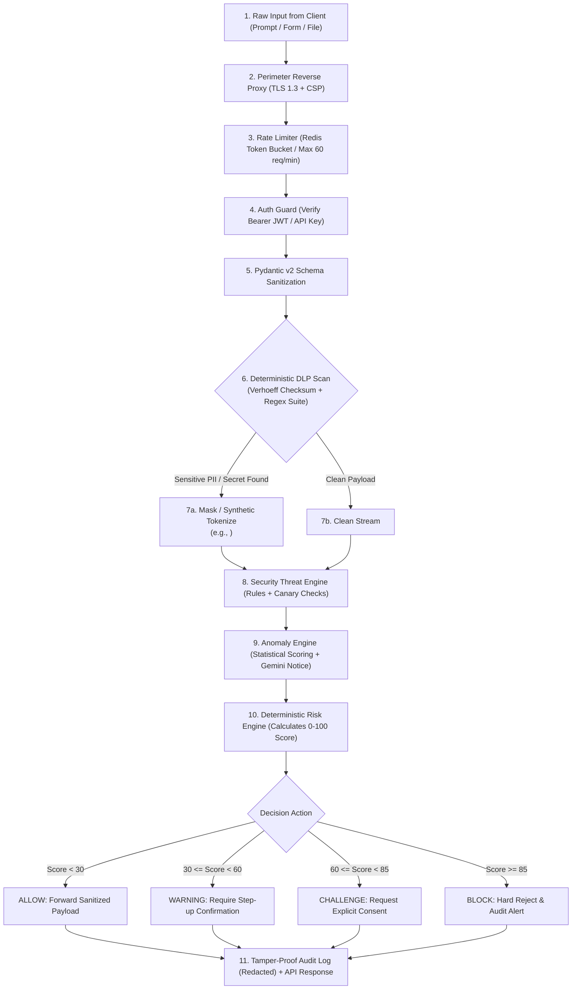

---

## 9. Security Boundaries & Zone Classification

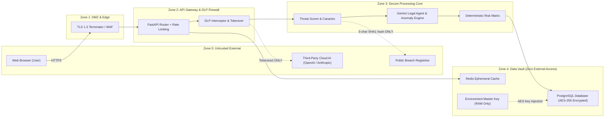

### Security Boundary Invariants:
1. **Plaintext Invariant**: No raw Aadhaar number, PAN card, or secret token may cross from Zone 2 into Zone 0 or Zone 3.
2. **Key Isolation Invariant**: Cryptographic keys exist exclusively in RAM (loaded from environment variables in Zone 4) and are never exposed via APIs or serialized in database backups.
3. **Outbound Guard Invariant**: Any outbound HTTP request to external third parties (HIBP, Gemini) must originate from an isolated HTTPX client enforcing an explicit host allowlist and strict 5-second socket timeouts.

---

## 10. Authentication Architecture

S.H.A.D.E. implements state-of-the-art authentication built on **Argon2id** password hashing and cryptographically signed **JSON Web Tokens (JWT)**:

### 10.1 Password Storage Specification
- **Algorithm**: `Argon2id` via `argon2-cffi`
- **Time Cost ($t$)**: 3 iterations
- **Memory Cost ($m$)**: 65,536 KiB (64 MiB)
- **Parallelism ($p$)**: 4 threads
- **Salt**: 16 bytes CSPRNG generated via `secrets.token_bytes(16)`
- **Rule**: Simple SHA-256, MD5, or un-salted hashes are strictly rejected by the backend validator.

### 10.2 Token Management Lifecycle
- **Access Tokens**: Short-lived (15 minutes), signed using HMAC-SHA256 (`HS256`) with a 256-bit secret key. Payload includes:
  - `sub`: User UUID
  - `role`: Authorization scope (`user`, `admin`, `auditor`)
  - `jti`: Unique token UUID (for revocation tracking)
  - `exp`: Expiration timestamp
- **Refresh Tokens**: Long-lived (7 days), stored in an encrypted database table with single-use rotation semantics.
- **Client Transport**: Delivered via `HttpOnly`, `Secure`, `SameSite=Strict` cookies. Tokens must not be stored in browser `localStorage` or `sessionStorage` to eliminate Cross-Site Scripting (XSS) extraction vectors.
- **Revocation**: Blacklisted token `jti` entries are pushed to Redis with an expiration matching the token's remaining TTL.

---

## 11. Authorization Architecture (RBAC)

FastAPI dependency injection enforces strict Role-Based Access Control on every non-public endpoint:

| Role | Permissions & Endpoint Access | Boundary Constraint |
| :--- | :--- | :--- |
| `ANONYMOUS` | Health check (`/health`), Login, Register, Public Demo Sandbox. | Strict rate limit (10 req/min). Cannot trigger external AI legal generation. |
| `USER_STANDARD` | Real-time DLP scanning, Personal Threat Index query, Canary generation, DPDP Section 12 notice synthesis. | Restricted to self-owned assets; tenant isolation enforced via `user_id` query filters. |
| `SECURITY_ADMIN` | System audit log exploration, global threat rule tuning, Canary breach trigger monitoring, user deactivation. | Requires Multi-Factor Step-Up verification. |
| `SYSTEM_DAEMON` | Background breach correlation jobs, ambient voice daemon REST interface (localhost only). | Restricted to `127.0.0.1` binding with dedicated preshared daemon token. |

---

## 12. DLP & Sensitive Data Detection Architecture

The DLP engine executes locally on the host CPU with zero external dependencies.

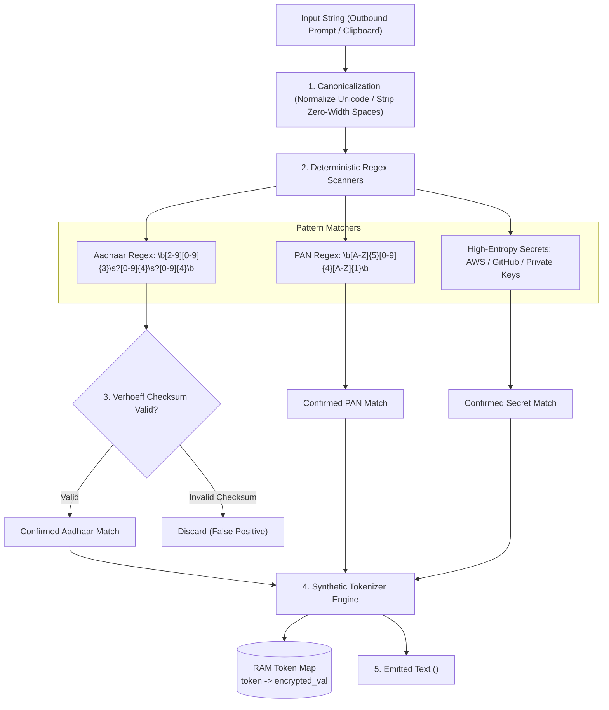

### 12.1 Verhoeff Algorithm Implementation Standard
The Indian Aadhaar number uses a base-10 Verhoeff checksum algorithm to eliminate false positive detections:
- **Multiplication Table ($d$)**: 10x10 dihedral group $D_5$ matrix.
- **Permutation Table ($p$)**: 8x10 permutation matrix.
- **Inverse Table ($inv$)**: Group inversion array.
- Any 12-digit number whose Verhoeff check fails is immediately discarded as a random numerical sequence, preventing unnecessary user disruptions.

### 12.2 Indian PAN Validation
Matches `[A-Z]{5}[0-9]{4}[A-Z]{1}`:
- 4th character represents entity type (`P` = Individual, `C` = Company, `H` = HUF, `F` = Firm, `T` = Trust).
- Validated to ensure structural authenticity prior to tokenization.

### 12.3 Synthetic Tokenization Mapping
When a sensitive item is detected, it is stored in a session-scoped AES-256-GCM encrypted vault in memory and replaced in the outbound stream with a deterministic synthetic placeholder:
- Format: `<SYN_{TYPE}_{CRC16_HASH}>`
- Example: `2668 5333 9452` $\rightarrow$ `<SYN_AADHAAR_9921>`
- Plaintext never reaches external LLMs or third-party APIs.

---

## 13. Security & Threat Engine Architecture

Owned by **Member 2**, this engine manages threat intelligence, leak attribution, and honey-tokens.

### 13.1 Canary Honey-Token Engine
To catch rogue data brokers and unauthorized data sharing:
1. When registering on external websites, S.H.A.D.E. generates a trackable synthetic decoy identity:
   - Email: `user+canary_{uuid12}@shade-vault.io`
   - Decoy Phone: Synthetic virtual number prefix
   - Embedded Watermark: Cryptographic token encoded into the registration metadata
2. If the canary email or credential appears in a public breach dump or spam registry, S.H.A.D.E. performs instant leak attribution, proving mathematically which service leaked or sold the user's data.

### 13.2 Breach Radar (HIBP k-Anonymity Standard)
Password breach verification strictly adheres to HIBP API v3 k-anonymity:
1. Compute local SHA-1: `h = hashlib.sha1(password.encode()).hexdigest().upper()`
2. Extract prefix: `prefix = h[:5]` (5 characters)
3. Extract suffix: `suffix = h[5:]` (35 characters)
4. Dispatch GET request: `https://api.pwnedpasswords.com/range/{prefix}`
5. Search response text for matching `suffix:count`.
6. **Strict Prohibition**: Neither the raw password nor identity data (Aadhaar, PAN, email) is ever dispatched to HIBP.

---

## 14. AI & Anomaly Engine Architecture

Owned by **Member 3**, this engine provides statistical outlier detection and statutory DPDP notice generation.

### 14.1 Explainable 3-Tier Hierarchy
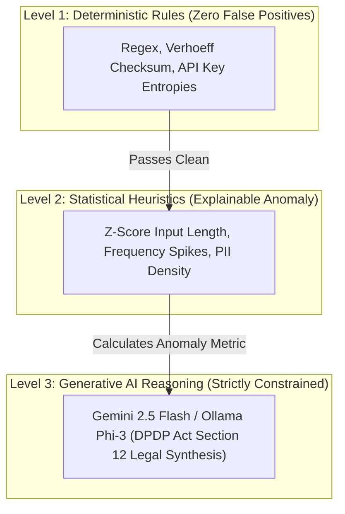

### 14.2 DPDP Act 2023 Section 12 Legal Takedown Generator
When a breach is attributed to a Data Fiduciary:
1. Member 3's pipeline extracts the Fiduciary legal name, registered Data Protection Officer (DPO) contact, and exposed data categories.
2. The generator constructs a formal statutory requisition citing:
   - **Section 12(1)**: Right to correction and erasure of personal data.
   - **Section 12(2)**: Right to grievance redressal.
   - **Section 8**: Obligations of Data Fiduciary to protect data.
3. Output is formatted into a 1-click email/PDF dispatch with statutory response timelines (30 days under Indian law).

---

## 15. Deterministic Risk Engine Architecture

The Risk Engine calculates the centralized **0–100 Exposome Threat Index**. It evaluates signals through a deterministic weighted matrix. AI models are **never** permitted to independently authorize or override security actions.

### 15.1 Risk Calculation Formula
$$\text{Exposome Threat Index} = \min\left(100, \sum_{i} w_i \cdot S_i + P_{\text{penalties}}\right)$$

Where:
- $S_{\text{breach}}$: Breach severity score ($w = 0.35$)
- $S_{\text{pii}}$: PII sensitivity density ($w = 0.30$)
- $S_{\text{anomaly}}$: Statistical behavioral anomaly score ($w = 0.20$)
- $S_{\text{canary}}$: Canary trip attribution indicator ($w = 0.15$)
- $P_{\text{penalties}}$: Direct policy violation penalties (e.g., exposed private key = $+50$)

### 15.2 Decision Thresholds & Actions

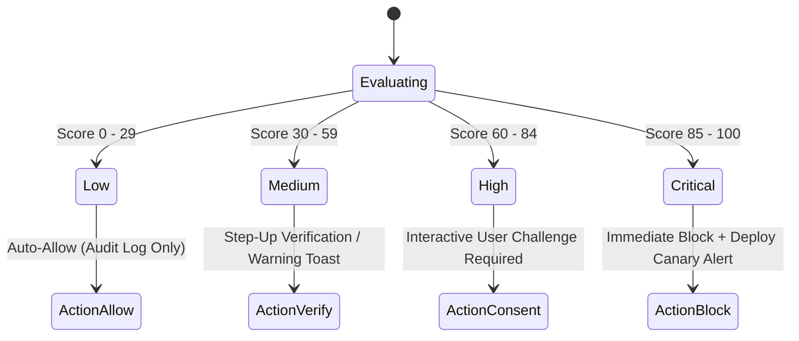

---

## 16. Backend Architecture & FastAPI Configuration

The backend application is structured around dependency injection, modular routing, and strict lifecycle events:

### Directory Structure & Responsibilities
```
backend/
├── app/
│   ├── api/
│   │   └── v1/
│   │       ├── router.py               # Main v1 aggregation router
│   │       ├── core.py                 # Health, system metrics, sessions
│   │       ├── security.py             # DLP scan, HIBP lookup, Canaries
│   │       ├── ai.py                   # Anomaly checks, DPDP legal generator
│   │       └── ui_feeds.py             # War-Room HUD aggregate stats
│   ├── core/
│   │   ├── config.py                   # Pydantic BaseSettings (reads .env)
│   │   ├── security.py                 # Argon2id, JWT, AES-256-GCM helpers
│   │   └── logging.py                  # Structured JSON logger with PII masking
│   ├── db/
│   │   ├── session.py                  # Async SQLAlchemy sessionmaker
│   │   └── base.py                     # DeclarativeBase class
│   ├── models/                         # Database entities
│   │   ├── user.py
│   │   ├── audit_log.py
│   │   ├── dlp_event.py
│   │   ├── canary_token.py
│   │   └── takedown_notice.py
│   ├── schemas/                        # Inter-module Pydantic contracts
│   │   ├── contracts.py                # DLP, Threat, Anomaly, Risk schemas
│   │   └── api_response.py             # Unified API response wrapper
│   ├── services/
│   │   ├── dlp/                        # Member 1 DLP engine & Verhoeff
│   │   ├── threat/                     # Member 2 Threat & Canary engine
│   │   └── intelligence/               # Member 3 Anomaly & DPDP engine
│   └── main.py                         # App factory, middlewares, exception handlers
├── requirements.txt
└── tests/
```

---

## 17. API Architecture & Standards

- **Base URL**: `/api/v1`
- **Transport**: HTTPS / TLS 1.3 enforced.
- **Content-Type**: `application/json; charset=utf-8`
- **Correlation ID**: Every request injects `X-Request-ID` via middleware for end-to-end tracing across logs and responses.
- **Security Headers**:
  - `Strict-Transport-Security: max-age=31536000; includeSubDomains`
  - `X-Content-Type-Options: nosniff`
  - `X-Frame-Options: DENY`
  - `Content-Security-Policy: default-src 'self'; frame-ancestors 'none';`
  - `Referrer-Policy: strict-origin-when-cross-origin`

---

## 18. Database Architecture & ER Diagram

The primary relational store is **PostgreSQL 16** (with SQLite fallback for local test resilience), managed via **SQLAlchemy 2.x** and **Alembic**.

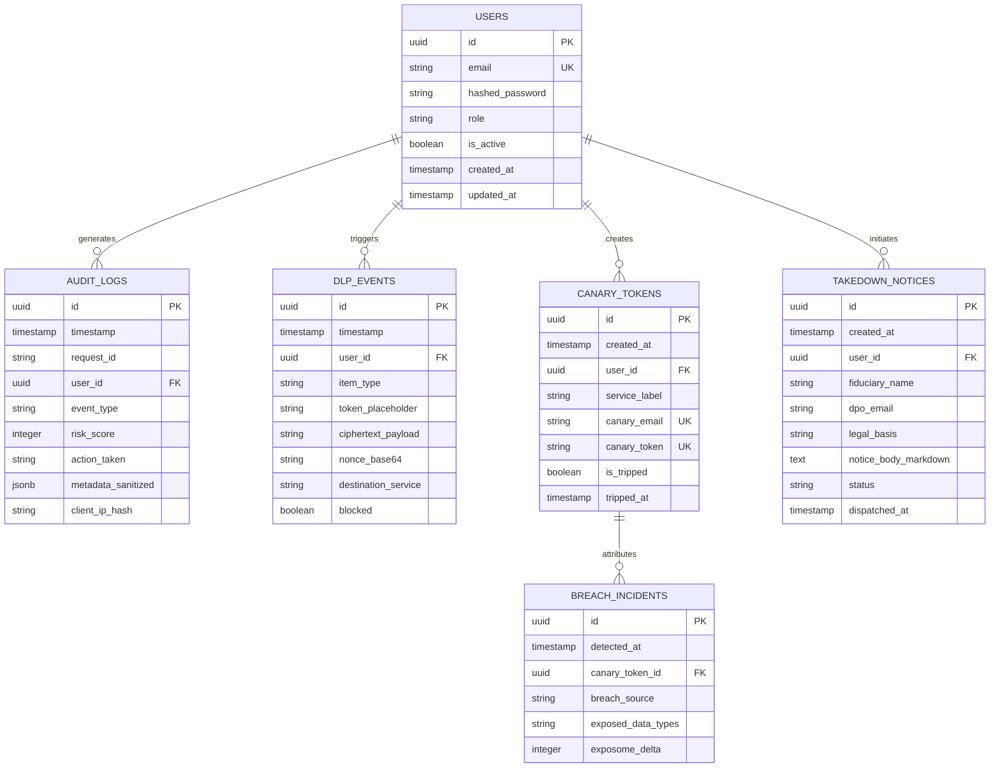

---

## 19. Redis Usage & Ephemeral Security State

Redis is employed exclusively for volatile operational security controls. **No persistent business data is stored in Redis.**

| Key Pattern | Data Structure | TTL | Purpose |
| :--- | :--- | :--- | :--- |
| `rl:{client_ip}:{endpoint}` | Sorted Set / Integer Counter | 60 seconds | Sliding-window API rate limiting (60 req/min). |
| `revoked:{jti}` | String (`"1"`) | Token remaining TTL | Instant JWT revocation / blacklisting. |
| `replay:{nonce}` | String (`timestamp`) | 300 seconds | Anti-replay guard for authenticated state updates. |
| `dlp_temp:{session_id}:{token}` | Encrypted String | 1800 seconds (30m) | In-memory synthetic token detokenization lookup table. |

---

## 20. HaveIBeenPwned (HIBP) k-Anonymity Integration

Password exposure checks strictly protect user privacy via the SHA-1 k-anonymity protocol:

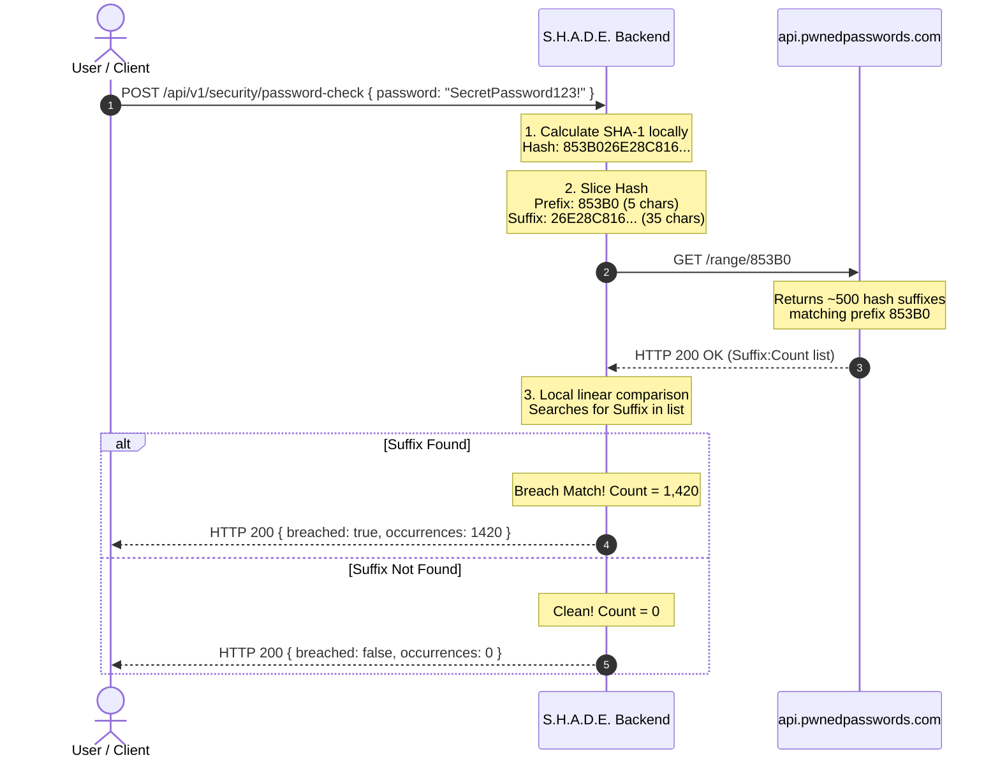

---

## 21. Encryption Strategy & Key Management

### 21.1 Authenticated Encryption at Rest
All sensitive records that must be persisted (such as encrypted detokenization vaults or canary mappings) utilize **AES-256-GCM** via Python's standard `cryptography.hazmat.primitives.ciphers.aead.AESGCM`:
- **Key**: 256 bits (32 bytes), injected via environment variable `SHADE_MASTER_ENCRYPTION_KEY`.
- **Nonce (IV)**: 96 bits (12 bytes), generated per encryption using `secrets.token_bytes(12)`. Nonce reuse is strictly prohibited.
- **Authentication Tag**: 128 bits (16 bytes) appended to ciphertext, guaranteeing tamper detection.

### 21.2 Key Management Rules
1. **Zero Hardcoded Secrets**: Master encryption keys, database passwords, and JWT secrets must never exist in git commits.
2. **Startup Assertion**: During FastAPI `lifespan` startup, the backend verifies that `SHADE_MASTER_ENCRYPTION_KEY` is present and exactly 32 bytes long. If missing or invalid, the server halts immediately with an explicit fatal error.

---

## 22. Secret Management & Git Hygiene

The repository enforces strict credential containment:
- `.gitignore` explicitly excludes `.env`, `.env.*`, `*.pem`, `*.key`, and `node_modules/`.
- A template [.env.example](file:///c:/Users/HP/Desktop/New%20folder%20(2)/KPRIET-HackITon26/.env.example) defines required environment variable keys with empty or dummy values.
- Automated pre-commit hooks and CI security checks (`pip-audit`) prevent credentials from reaching git history.

---

## 23. Structured Logging & Audit Trail

Structured logs are emitted in JSON format to stdout. The custom logging filter automatically sanitizes all log events before output:

```json
{
  "timestamp": "2026-10-08T14:45:10.124Z",
  "level": "INFO",
  "request_id": "req_01j9x7k5v4e7bm9a8q",
  "user_id": "usr_998124b6",
  "event_type": "DLP_INTERCEPTION_SUCCESS",
  "risk_score": 75,
  "action_taken": "TOKENIZE_AND_PASS",
  "details": {
    "item_type": "AADHAAR_CARD",
    "token_assigned": "<SYN_AADHAAR_9921>",
    "redacted_value": "********9921",
    "destination": "cloud_llm_prompt"
  }
}
```

**Logging Masking Rule**: Raw 12-digit Aadhaar numbers, 10-character PANs, raw passwords, and JWT tokens are matched by an output stream filter and transformed into `********[LAST4]` or suppressed entirely.

---

## 24. Centralized Error Handling

Errors follow the **RFC 7807 (Problem Details)** standard. Internal details, database SQL queries, and Python tracebacks are never exposed to clients:

```json
{
  "type": "https://shade.security/errors/rate-limit-exceeded",
  "title": "Rate Limit Exceeded",
  "status": 429,
  "detail": "Too many requests. Quota allows 60 requests per minute.",
  "instance": "/api/v1/security/scan",
  "request_id": "req_01j9x7k5v4e7bm9a8q",
  "timestamp": "2026-10-08T14:45:10.124Z"
}
```

---

## 25. Testing Architecture & Security Test Suite

The test suite is organized into distinct functional and adversarial tiers using `pytest` and `pytest-asyncio`:

- **Unit Tests**:
  - `tests/test_verhoeff.py`: Verhoeff checksum calculation, permutation validation, valid/invalid Aadhaar matrices.
  - `tests/test_dlp_regex.py`: PAN format validation, false-positive resistance, high-entropy secret detection.
  - `tests/test_risk_engine.py`: Deterministic score evaluation, threshold transitions, penalty weights.
- **Integration Tests**:
  - `tests/test_api_contracts.py`: Pydantic v2 schema compliance across all v1 routers.
  - `tests/test_hibp_client.py`: Mocked k-anonymity queries, network failure failover.
- **Adversarial & Security Tests**:
  - SQL Injection fuzz payloads against search inputs.
  - XSS payload sanitization on takedown notice inputs.
  - Rate-limit saturation and brute-force lock verification.
  - Token tamper testing (invalid HMAC signatures, expired JWTs).

---

## 26. Dependency Security

- **Python**: Automated dependency vulnerability scanning via `pip-audit`. All versions pinned in `requirements.txt`.
- **Node.js**: Regular vulnerability scans via `npm audit --omit=dev`.
- **Minimalist Policy**: Zero exotic dependencies. Standard Python standard library modules (`re`, `hashlib`, `hmac`, `secrets`) are prioritized over unmaintained third-party packages.

---

## 27. Deployment Architecture

```
[User Browser]
       │
       ▼ (Port 443 / HTTPS)
[Reverse Proxy: Caddy / Nginx]
       │
       ▼ (127.0.0.1:8000 / ASGI)
[FastAPI Backend Application]
       │
  ┌────┴──────────────────────────┐
  ▼                               ▼
[PostgreSQL Database: 5432]     [Redis Service: 6379]
```

### Reproducible Docker Compose Specification
- `backend`: Python 3.12-slim container running `uvicorn app.main:app --host 0.0.0.0 --port 8000`.
- `db`: PostgreSQL 16 Alpine container with isolated healthcheck.
- `cache`: Redis 7 Alpine container configured with `maxmemory 256mb` and `maxmemory-policy volatile-lru`.
- `frontend`: Vite static build served via Caddy or Nginx with strict security headers.

---

## 28. Team Ownership & Branch Mapping

| Role | Member | Primary Git Branch | Dedicated Ownership Directory |
| :--- | :--- | :--- | :--- |
| **Core Architecture & Integration** | **Member 1** | `member-1/backend` | `backend/app/core/`, `backend/app/db/`, `backend/app/models/`, `backend/app/schemas/`, `backend/app/api/v1/core.py`, `backend/app/services/dlp/`, `docs/` |
| **Security & Threat Engine** | **Member 2** | `member-2/security` | `backend/app/services/threat/`, `backend/app/api/v1/security.py`, `tests/test_threat/` |
| **AI/ML & Anomaly Analysis** | **Member 3** | `member-3/ai` | `backend/app/services/intelligence/`, `backend/app/api/v1/ai.py`, `tests/test_intelligence/` |
| **Frontend & User Workflow** | **Member 4** | `member-4/frontend` | `frontend/`, `backend/app/api/v1/ui_feeds.py` |

---

## 29. Integration Contracts (Pydantic v2 Schemas)

All inter-module communication is governed by strict Pydantic v2 schemas:

### 29.1 DLP Inspection Contract (Member 1)
```python
from pydantic import BaseModel, Field
from typing import List, Optional

class DLPInspectionRequest(BaseModel):
    raw_content: str = Field(..., min_length=1, max_length=50000, description="Outbound prompt or clipboard payload")
    source_context: str = Field(default="prompt", description="Origin: prompt, clipboard, form")

class DLPDetectionItem(BaseModel):
    item_type: str = Field(..., description="AADHAAR, PAN, API_KEY, PASSWORD")
    token_assigned: str = Field(..., description="<SYN_AADHAAR_9921>")
    redacted_preview: str = Field(..., description="Masked display representation")
    confidence: float = Field(default=1.0)

class DLPInspectionResponse(BaseModel):
    is_clean: bool
    sanitized_content: str
    detections: List[DLPDetectionItem]
    scan_duration_ms: float
```

### 29.2 Threat Analysis Contract (Member 2)
```python
class ThreatAnalysisRequest(BaseModel):
    user_identity: str = Field(..., description="Email or pseudonym to evaluate")
    include_breaches: bool = True
    include_canaries: bool = True

class CanaryTripRecord(BaseModel):
    canary_id: str
    service_label: str
    tripped_at: str
    breach_source: Optional[str]

class ThreatAnalysisResponse(BaseModel):
    exposome_score: int = Field(..., ge=0, le=100)
    threat_level: str = Field(..., description="LOW, MEDIUM, HIGH, CRITICAL")
    breaches_detected: int
    tripped_canaries: List[CanaryTripRecord]
    recommended_action: str
```

### 29.3 Anomaly Analysis & Legal Synthesis Contract (Member 3)
```python
class AnomalyEvaluationRequest(BaseModel):
    content_length: int
    pii_density: float
    request_frequency: float

class AnomalyEvaluationResponse(BaseModel):
    anomaly_score: float = Field(..., ge=0.0, le=1.0)
    is_anomalous: bool
    heuristic_notes: List[str]

class DPDPNoticeDraftRequest(BaseModel):
    fiduciary_name: str = Field(..., min_length=2)
    dpo_email: Optional[str] = None
    violation_context: str
    user_legal_name: str

class DPDPNoticeDraftResponse(BaseModel):
    fiduciary_name: str
    legal_basis: str
    statutory_deadline_days: int
    notice_body_markdown: str
    dispatch_ready: bool
```

### 29.4 Unified Risk Evaluation Contract (Integrated)
```python
class RiskEvaluationRequest(BaseModel):
    dlp_detections_count: int
    threat_exposome: int
    anomaly_score: float
    critical_policy_violation: bool = False

class RiskEvaluationResponse(BaseModel):
    final_risk_score: int = Field(..., ge=0, le=100)
    tier: str = Field(..., description="LOW, MEDIUM, HIGH, CRITICAL")
    action: str = Field(..., description="ALLOW, VERIFY, CHALLENGE, BLOCK")
    explanation: str
```

---

## 30. Golden Development Rules

1. **Rule 1 (Inspect Before Edit)**: Always check git status and existing implementations before modifying files.
2. **Rule 2 (No Cross-Module Commits)**: Develop only inside your assigned directory on your assigned branch.
3. **Rule 3 (Never Touch Working Code)**: Working, verified code must never be refactored or deleted without team consensus.
4. **Rule 4 (No Plaintext Secrets)**: Never commit `.env`, passwords, or API keys to git.
5. **Rule 5 (Deterministic Authority)**: AI/ML components must never independently authorize sensitive actions.
6. **Rule 6 (Fail-Safe Offline Mode)**: Every cloud API integration must have an instant local mock fallback for hackathon venue resilience.

---

## 31. Security Assumptions & Threat Model

- **Host Machine Trust**: S.H.A.D.E. assumes the host OS kernel and physical hardware are not compromised with kernel rootkits.
- **TLS Channel Integrity**: Client-server communication is assumed to be protected by valid TLS certificates.
- **Non-Repudiation**: Audit logs with monotonic timestamps and client hashes provide defensible forensic records.

---

## 32. Known Limitations & Hackathon Boundaries

- **Browser Extension Scope**: Full real-time browser DOM prompt interception is simulated via the War-Room HUD Interactive Sandbox during the 24-hour prototype phase.
- **OSINT API Throttling**: Live HIBP queries are subject to cloud rate limits; local pre-cached hash sets ensure zero demo interruptions.
- **OCR on Scanned Identity Documents**: Offline Verhoeff and regex analysis target text streams; full optical OCR on images is slated for Phase 2.

---

## 33. Future Extension Points

- **Decentralized Audit Proofs**: Anchoring tamper-evident audit log hashes onto a permissioned consortium ledger for unalterable court evidence under DPDP Act proceedings.
- **Native OS Keyboard & Clipboard Hook**: C++ / Rust lightweight daemon intercepting OS-level clipboard events before they reach any running application.
- **Autonomous DPO Dispatch**: Direct SMTP / Indian National Cyber Crime Portal API integration for automated notice submission.

---

## 34. Comprehensive Sequence Diagrams

### 34.1 Normal Request Flow
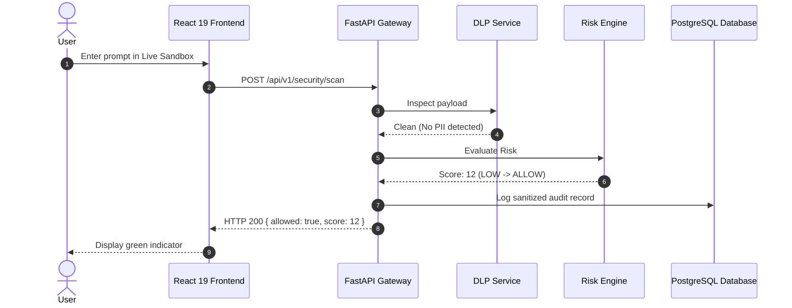

### 34.2 High-Risk Request Flow (Aadhaar Leak Attempt)
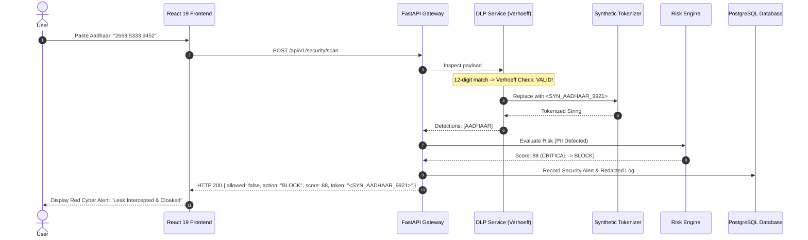

### 34.3 Authentication Flow
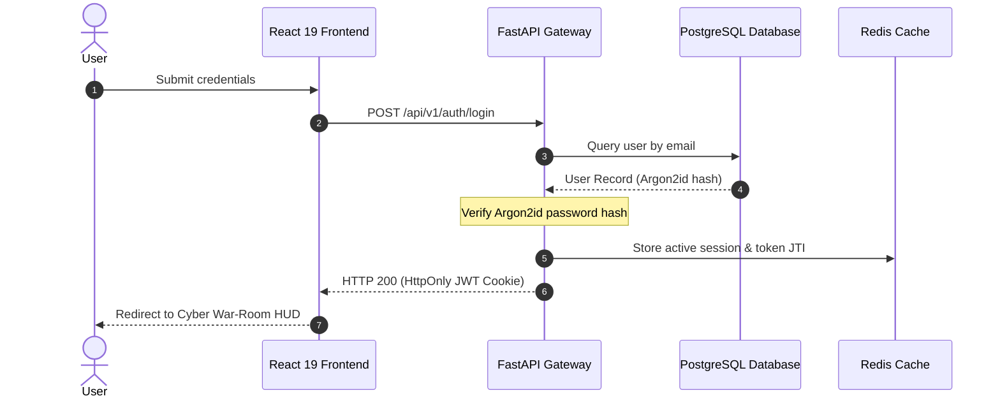

### 34.4 DLP & Synthetic Tokenization Flow
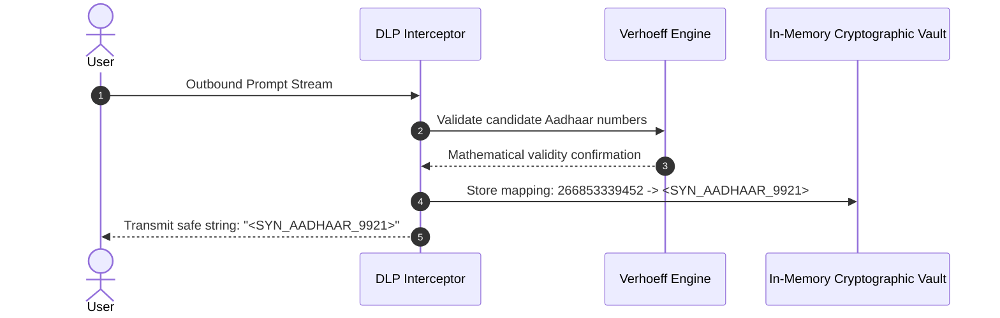

### 34.5 AI / Anomaly Analysis Flow
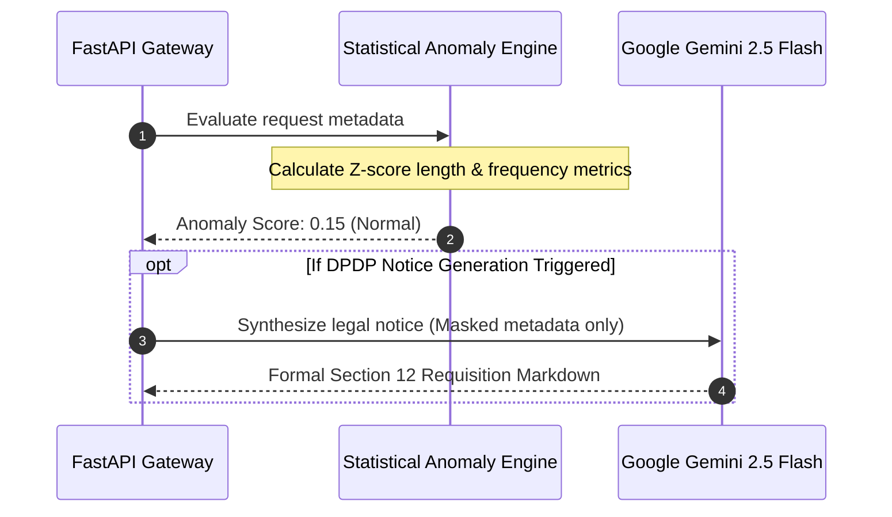

### 34.6 Risk Engine Decision Flow
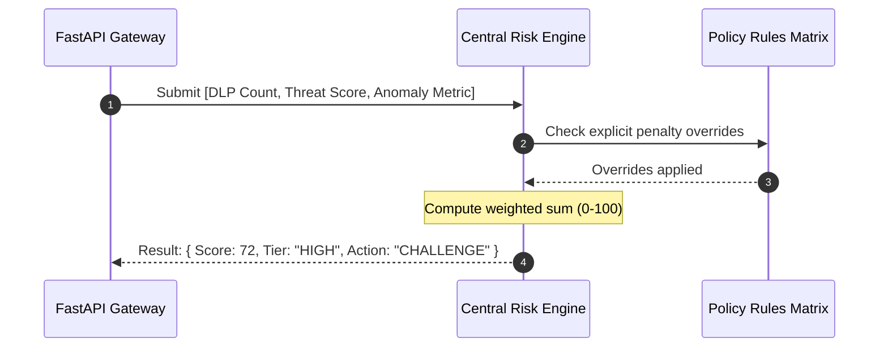

### 34.7 HIBP k-Anonymity Flow
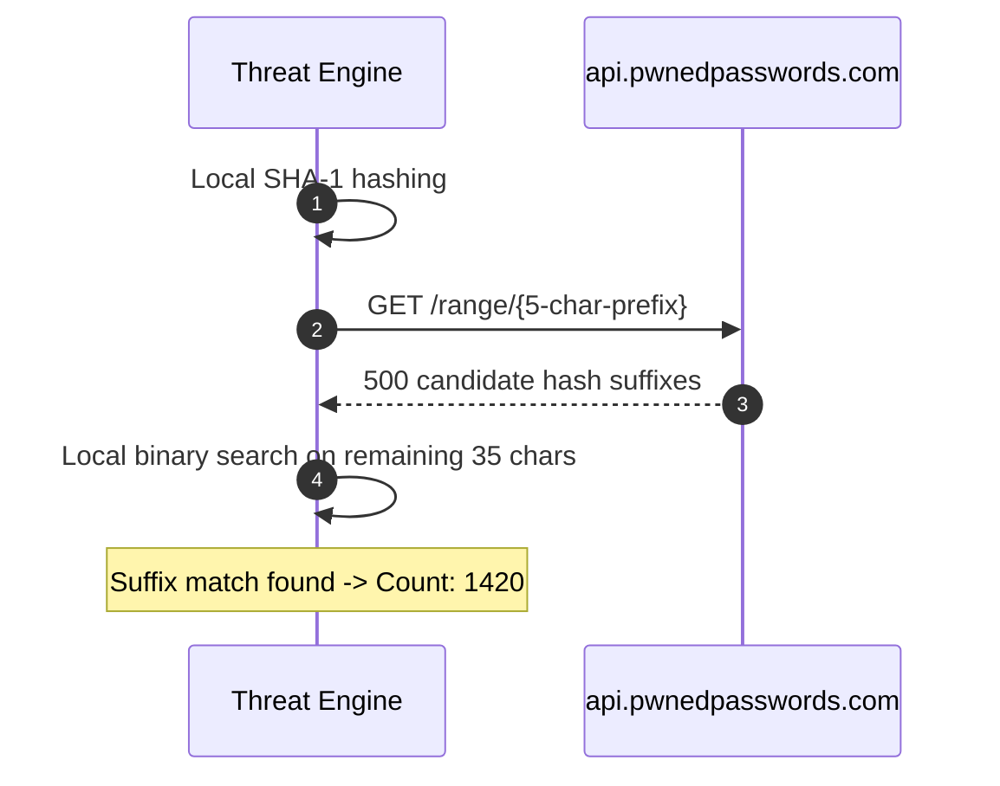

### 34.8 Audit Logging Flow
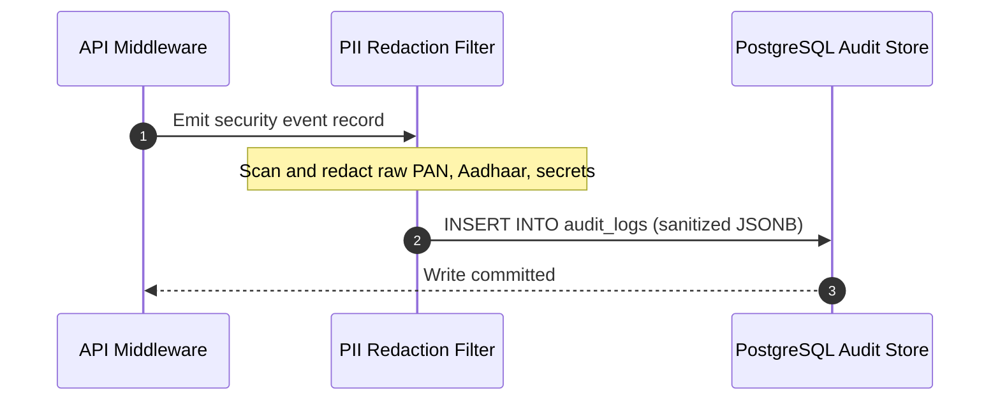

### 34.9 Centralized Error & Failure Flow
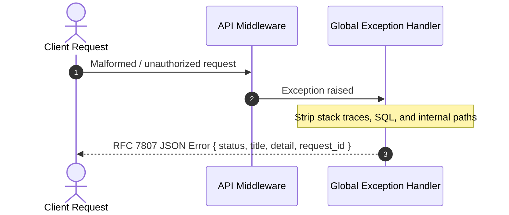
