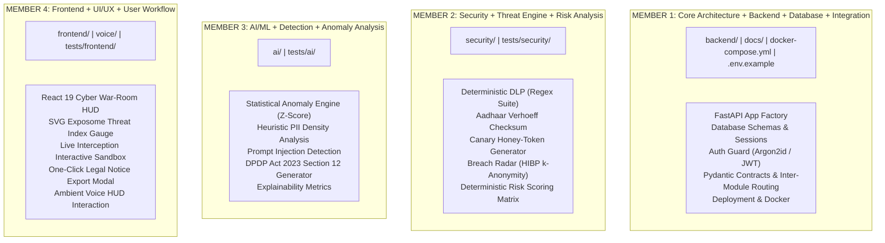

# S.H.A.D.E. — Repository Architecture & Module Ownership Specification
**Synthetic Host for Anonymization, Detection & Enforcement**  
*Document Version: 1.0.0 | Status: ACTIVE REPOSITORY BLUEPRINT | Date: October 2026*  
*Repository: Shashank-1920/KPRIET-HackITon26 | Workstream: Member 1 (Core Architecture + Backend + Database + Integration)*

---

## 1. Complete Repository Tree

```
KPRIET-HackITon26/
│
├── backend/                               ← MEMBER 1: Core Architecture + Backend + Database
│   ├── api/                               # FastAPI routing & endpoint registration
│   │   ├── routes/                        # Versioned routes (v1 core endpoints)
│   │   └── dependencies/                  # Auth guards, DB injection, rate limits
│   ├── core/                              # App configuration, security settings, logging
│   ├── database/                          # Connection manager, session factory, migrations
│   │   ├── migrations/                    # Alembic revision scripts
│   │   ├── connection.py                  # Engine configuration & connection pooling
│   │   └── session.py                     # Async session context managers
│   ├── models/                            # SQLAlchemy ORM declarative models
│   ├── schemas/                           # Pydantic v2 data contracts & validation
│   ├── services/                          # Service orchestration layer
│   ├── security/                          # Ingress security middleware & token handlers
│   ├── main.py                            # ASGI application factory & lifecycle events
│   └── README.md                          # Member 1 ownership guide & rules
│
├── security/                              ← MEMBER 2: Security + Threat Engine + Risk Analysis
│   ├── dlp/                               # Deterministic Data Loss Prevention engine
│   │   ├── detectors/                     # Aadhaar, PAN, API key, password detectors
│   │   ├── patterns/                      # Compiled regex suites & format specifications
│   │   ├── masking/                       # Display redaction & privacy formatters
│   │   └── tokenizer/                     # Synthetic placeholder generator (<SYN_AADHAAR_xxxx>)
│   ├── validators/                        # Mathematical document validators
│   │   └── verhoeff/                      # Dihedral D5 Verhoeff checksum algorithm
│   ├── threat_engine/                     # Breach correlation, threat rules, honeytokens
│   ├── risk_engine/                       # Centralized 0-100 Exposome Threat Index calculator
│   ├── breach_radar/                      # Privacy-preserving HIBP k-anonymity client (SHA-1)
│   └── README.md                          # Member 2 ownership guide & rules
│
├── ai/                                    ← MEMBER 3: AI/ML + Detection + Anomaly Analysis
│   ├── anomaly/                           # Statistical outlier & anomalous behavior scoring
│   ├── heuristics/                        # Explainable heuristic filters (Z-score, PII density)
│   ├── models/                            # Scikit-learn models & inference handlers (if required)
│   ├── analysis/                          # Behavioral evaluation & classification pipelines
│   ├── templates/                         # DPDP Act 2023 Section 12 legal notice templates
│   └── README.md                          # Member 3 ownership guide & rules
│
├── frontend/                              ← MEMBER 4: Frontend + UI/UX + User Workflow
│   ├── src/                               # React 19 application source
│   │   ├── components/                    # Modular UI components (ThreatGauge, AlertBanner)
│   │   ├── pages/                         # Route views (Dashboard, Sandbox, Takedown, Settings)
│   │   ├── services/                      # API client integration (communicates via /api/v1)
│   │   ├── hooks/                         # React hooks for state and live streaming
│   │   └── utils/                         # Formatting utilities & visual helpers
│   ├── public/                            # Static assets, icons, audio cues
│   ├── package.json                       # Node dependencies & Vite configuration
│   └── README.md                          # Member 4 ownership guide & rules
│
├── voice/                                 ← PLANNED AUDIO MODULE (Shared / Member 4)
│   ├── wakeword/                          # Offline Porcupine "Hey Shade" listener
│   ├── stt/                               # Offline Vosk speech-to-text engine
│   ├── tts/                               # Offline Pyttsx3 speech synthesizer
│   └── README.md                          # Voice module interface & hardware failover guide
│
├── tests/                                 ← TEST SUITE (All Members)
│   ├── backend/                           # Member 1: API, DB, and Auth tests
│   ├── security/                          # Member 2: Verhoeff, DLP regex, HIBP tests
│   ├── ai/                                # Member 3: Anomaly scoring & legal notice tests
│   ├── frontend/                          # Member 4: Component & workflow tests
│   └── integration/                       # Shared: End-to-end multi-module integration tests
│
├── docs/                                  ← ARCHITECTURE & DOCUMENTATION (Member 1)
│   └── architecture/
│       ├── ARCHITECTURE.md                # Master system architecture & technical blueprint
│       ├── REPOSITORY_STRUCTURE.md         # Repository structure & module ownership (this file)
│       └── diagrams/                      # System diagrams (SVG, Mermaid, data flow)
│
├── scripts/                               ← UTILITY & REPOSITORY SCRIPTS (Shared)
│   ├── dev_setup.ps1                      # Local development bootstrapping script
│   └── seed_demo_data.py                  # Offline demo breach & broker seed dataset
│
├── .env.example                           # Template environment configuration (No secrets)
├── .gitignore                             # Git exclusion rules (Secrets, caches, dependencies)
├── docker-compose.yml                     # Multi-container deployment configuration
└── README.md                              # Project landing page, setup guide, and team rules
```

---

## 2. Purpose of Every Major Folder

| Directory | Primary Purpose | Primary Tech Stack |
| :--- | :--- | :--- |
| `backend/` | Central API gateway, ASGI application, DB connections, auth enforcement, service integration. | Python 3.12+, FastAPI, Uvicorn, SQLAlchemy 2.x, Pydantic v2 |
| `security/` | Deterministic DLP interception, Verhoeff checksums, Canary honeytokens, HIBP k-anonymity client. | Python standard library (`re`, `hashlib`, `secrets`), `cryptography` |
| `ai/` | Explainable statistical anomaly detection, Z-score analysis, DPDP Act Section 12 legal notice synthesis. | Python heuristics, Scikit-learn (if justified), Gemini Flash / Ollama |
| `frontend/` | Cyber War-Room HUD, SVG Threat Index gauge, live DLP sandbox, takedown generator modal. | React 19, Vite, Vanilla CSS, Lucide React |
| `voice/` | Hands-free audio interaction, offline wake-word listener, local TTS status briefings. | Picovoice Porcupine, Vosk, Pyttsx3 |
| `tests/` | Unit, integration, security fuzzing, and adversarial test suites. | Pytest, pytest-asyncio, HTTPX AsyncClient, Vitest |
| `docs/` | Comprehensive architectural blueprints, threat modeling, API contract definitions. | Markdown, Mermaid, SVG |
| `scripts/` | Local environment bootstrapping, database seeding, test dataset generation. | PowerShell, Python |

---

## 3. Team Ownership & Responsibilities



---

## 4. Module Boundaries & Isolation

To eliminate race conditions and merge conflicts across four developers:
1. **Module Autonomy**: Each module (`backend`, `security`, `ai`, `frontend`) must maintain self-contained logic within its root folder.
2. **Interface Decoupling**: Modules must never import private internal functions from other modules. All inter-module communication is channeled through public service interfaces defined in `backend/schemas/`.
3. **No Direct Database Access**: Only `backend/` holds database session managers. `security/` and `ai/` receive input dataclasses/schemas and return output dataclasses/schemas without querying the database directly.
4. **No Direct External Outbound Calls from AI**: `ai/` components do not establish independent network connections. External LLM requests (Gemini) are orchestrated through backend allowlist HTTP clients.

---

## 5. Dependency Direction

The architecture enforces a strict **unidirectional dependency flow**. Circular dependencies are strictly forbidden:

```
[FRONTEND (Member 4)]
        │
        ▼ (HTTPS / REST API Contracts)
[BACKEND / API GATEWAY (Member 1)]
        │
   ┌────┴───────────────────────────┐
   ▼                                ▼
[SECURITY ENGINE (Member 2)]   [AI / ANOMALY ENGINE (Member 3)]
   │                                │
   └────────────┬───────────────────┘
                ▼ (Service Orchestration)
[DATABASE & TEMPORARY CACHE (Member 1)]
```

### Prohibited Dependency Vectors:
- `frontend` $\rightarrow$ `database` ❌ (Frontend MUST NOT touch PostgreSQL or Redis)
- `frontend` $\rightarrow$ `security` ❌ (Frontend MUST NOT import backend Python security code directly)
- `security` $\rightarrow$ `frontend` ❌ (Security logic must remain UI-agnostic)
- `ai` $\rightarrow$ `frontend` ❌ (AI analysis must remain UI-agnostic)
- `ai` $\rightarrow$ `database` ❌ (AI must not query DB directly; requests pass through backend)

---

## 6. Integration Boundaries & API Contracts

Every inter-module boundary is guarded by strict Pydantic v2 validation contracts defined in `backend/schemas/`:

```
User Input ──▶ [Pydantic Ingress Validation]
                   │
                   ▼
              [DLP Inspection Request] ──▶ security/dlp/
                   │
                   ▼
              [Threat Analysis Request] ──▶ security/threat_engine/
                   │
                   ▼
              [Anomaly Request] ─────────▶ ai/anomaly/
                   │
                   ▼
              [Risk Evaluation Request] ──▶ security/risk_engine/
                   │
                   ▼
              [Audit Event] ─────────────▶ backend/database/
```

---

## 7. Security Boundaries & Zone Classification

| Zone | Boundary Description | Enforced Controls |
| :--- | :--- | :--- |
| **Zone 0: Untrusted External** | User browser, third-party LLMs (OpenAI/Anthropic), external web services. | Strict CORS, WAF, TLS 1.3, Rate limiting (60 req/min). |
| **Zone 1: Perimeter / DMZ** | Reverse Proxy (Caddy/Nginx) terminating TLS. | Security headers (HSTS, CSP, X-Frame-Options, nosniff). |
| **Zone 2: Ingress API Gateway** | FastAPI main application and routing middleware. | JWT validation, Argon2id auth, Pydantic sanitization, input canonicalization. |
| **Zone 3: Core Service Vault** | Security Engine, Anomaly Engine, Risk Engine, DLP Tokenizer. | In-memory execution, deterministic Verhoeff checksums, synthetic replacement. |
| **Zone 4: Data Vault** | PostgreSQL database, Redis ephemeral cache, local secrets. | AES-256-GCM encryption, RAM-only master keys, parameterized SQL, zero external access. |

---

## 8. Backend Repository Structure (`backend/`)
**Owner: Member 1**

```
backend/
├── api/
│   ├── routes/
│   │   ├── auth.py              # Login, registration, token refresh
│   │   ├── core.py              # System health, telemetry, session status
│   │   ├── dlp.py               # Outbound prompt DLP scan endpoint
│   │   ├── threat.py            # Threat index & breach scan endpoints
│   │   ├── takedown.py          # DPDP Section 12 notice synthesis endpoints
│   │   └── ui_feeds.py          # War-Room HUD aggregate stats
│   └── dependencies/
│       ├── auth_guard.py        # JWT verification & RBAC dependencies
│       ├── rate_limit.py        # Redis sliding-window dependency
│       └── db_session.py        # SQLAlchemy async session injection
├── core/
│   ├── config.py                # Environment configuration via pydantic-settings
│   ├── security.py              # Argon2id password hashing & JWT signing helpers
│   └── logging.py               # Structured JSON logger with real-time PII redaction filter
├── database/
│   ├── connection.py            # Async engine configuration (PostgreSQL / SQLite fallback)
│   ├── session.py               # Async sessionmaker and transaction contexts
│   └── migrations/              # Alembic environment and versions
├── models/
│   ├── user.py                  # User entity & role definitions
│   ├── audit_log.py             # Tamper-evident audit trail model
│   ├── dlp_event.py             # Intercepted leak event metadata
│   ├── canary_token.py          # Decoy credentials & leak tracking records
│   └── takedown_notice.py       # DPDP Act legal notice records
├── schemas/
│   ├── api_response.py          # Uniform RFC 7807 error and response envelopes
│   ├── contracts.py             # Cross-module Pydantic contracts
│   └── user.py                  # User authentication schemas
├── services/                    # Orchestration layer coordinating security/ai modules
└── main.py                      # FastAPI application factory, CORS, and lifecycle handlers
```

---

## 9. Security Repository Structure (`security/`)
**Owner: Member 2**

```
security/
├── dlp/
│   ├── detectors/
│   │   ├── aadhaar_detector.py  # 12-digit Indian Aadhaar regex matcher
│   │   ├── pan_detector.py      # Indian PAN regex format validator
│   │   ├── secrets_detector.py  # AWS, GitHub, high-entropy key detector
│   │   └── password_detector.py # Cleartext password pattern detector
│   ├── patterns/
│   │   └── regex_suite.py       # Centralized compiled regex expressions
│   ├── masking/
│   │   └── redactor.py          # UI preview masking (e.g., ********9452)
│   └── tokenizer/
│       └── synthetic_vault.py   # Tokenizer generating <SYN_AADHAAR_xxxx>
├── validators/
│   └── verhoeff/
│       └── verhoeff.py          # Dihedral D5 Verhoeff checksum validator
├── threat_engine/
│   ├── canaries.py              # Decoy credential & honey-token generator
│   └── correlation.py           # Breach dump attribution matcher
├── risk_engine/
│   └── calculator.py            # Central 0-100 Exposome Threat Index calculator
└── breach_radar/
    └── hibp_client.py           # k-Anonymity SHA-1 range query client
```

---

## 10. AI Repository Structure (`ai/`)
**Owner: Member 3**

```
ai/
├── anomaly/
│   └── detector.py              # Statistical outlier evaluation (Z-Score)
├── heuristics/
│   ├── pii_density.py           # Text entropy & PII frequency analysis
│   └── injection_filter.py      # Prompt injection heuristic scanner
├── models/
│   └── baseline_classifier.py   # Scikit-learn isolation forest / heuristic model
├── analysis/
│   └── explainability.py        # Generates human-readable score justifications
└── templates/
    ├── dpdp_section12.md        # DPDP Act 2023 Section 12 legal notice template
    └── legal_prompt.py          # Masked prompt pipeline for Gemini Flash / Ollama
```

---

## 11. Frontend Repository Structure (`frontend/`)
**Owner: Member 4**

```
frontend/
├── src/
│   ├── components/
│   │   ├── ThreatMeter.jsx      # SVG 0-100 cybernetic threat index gauge
│   │   ├── SandboxConsole.jsx   # Live outbound prompt DLP interception sandbox
│   │   ├── CanaryManager.jsx    # Honeytoken generator & leak attribution card
│   │   ├── TakedownModal.jsx    # DPDP Section 12 legal notice preview & export
│   │   └── VoiceHUD.jsx         # Ambient audio status and simulation chips
│   ├── pages/
│   │   ├── Dashboard.jsx        # Main Cyber War-Room HUD
│   │   ├── BreachRadar.jsx      # Identity footprint exposure visualization
│   │   └── AuditLogs.jsx        # Security event forensics table
│   ├── services/
│   │   └── api.js               # Centralized HTTP client consuming /api/v1
│   ├── hooks/
│   │   └── useThreatFeed.js     # Polling/WebSocket hook for real-time telemetry
│   ├── utils/
│   │   └── formatters.js        # Date, score, and token formatting helpers
│   ├── index.css                # Cyberpunk dark-mode glassmorphic styles
│   └── App.jsx                  # Main application router
├── public/                      # Static icons, favicons, audio assets
└── package.json                 # React 19 + Vite + Lucide React configuration
```

---

## 12. Voice Module Structure (`voice/`)
**Planned Module (Shared / Member 4)**

```
voice/
├── wakeword/
│   └── listener.py              # Picovoice Porcupine "Hey Shade" listener
├── stt/
│   └── transcriber.py           # Offline Vosk speech-to-text model handler
├── tts/
│   └── synthesizer.py           # Pyttsx3 offline text-to-speech engine
└── daemon.py                    # Standalone background audio daemon
```
*Note: Voice module interacts exclusively via local REST requests (`127.0.0.1:8000/api/v1/`) and includes an on-screen simulation HUD for auditorium noise failover.*

---

## 13. Testing Structure (`tests/`)

```
tests/
├── backend/                     # Member 1
│   ├── test_auth.py             # Argon2id hashing, JWT signing, token rotation
│   ├── test_rate_limiter.py     # Redis sliding-window throttling
│   └── test_api_contracts.py    # Pydantic v2 contract enforcement
├── security/                    # Member 2
│   ├── test_verhoeff.py         # Verhoeff checksum edge cases & Aadhaar tests
│   ├── test_dlp_regex.py        # Indian PAN & API key pattern matching
│   ├── test_hibp_client.py      # k-Anonymity SHA-1 prefix query tests
│   └── test_risk_engine.py      # 0-100 weighted risk calculation tests
├── ai/                          # Member 3
│   ├── test_anomaly.py          # Z-score statistical anomaly scoring
│   └── test_dpdp_notice.py      # Legal notice generation and template checks
├── frontend/                    # Member 4
│   └── test_components.jsx      # React component rendering and threat meter tests
└── integration/                 # Shared
    └── test_end_to_end.py       # Full flow: Input -> DLP -> Risk -> Audit
```

---

## 14. Documentation Structure (`docs/`)
**Owner: Member 1**

```
docs/
└── architecture/
    ├── ARCHITECTURE.md          # 34-section technical system architecture
    ├── REPOSITORY_STRUCTURE.md   # Complete folder tree, module ownership, and git rules
    └── diagrams/
        └── repository_architecture.svg  # Master repository architecture visual diagram
```

---

## 15. Configuration Structure (`.env.example`)

All runtime secrets and service parameters are injected via environment variables. The committed `.env.example` file contains sanitized templates:
- `SHADE_ENV`: `development` | `production` | `demo`
- `SHADE_PORT`: `8000`
- `SHADE_MASTER_ENCRYPTION_KEY`: 32-byte base64 string for AES-256-GCM vault
- `SHADE_JWT_SECRET`: 256-bit secret key for HMAC-SHA256 tokens
- `DATABASE_URL`: PostgreSQL connection string (defaults to local SQLite for offline demo)
- `REDIS_URL`: Redis connection string (defaults to in-memory mock for offline demo)
- `GEMINI_API_KEY`: Google Gemini API key (optional; falls back to local legal template)

---

## 16. Deployment Configuration (`docker-compose.yml`)

A self-contained Docker Compose file deploys the entire production stack:
- `backend`: FastAPI service exposed on `127.0.0.1:8000`
- `frontend`: Vite React build served via Nginx/Caddy on port `80`/`443`
- `postgres`: PostgreSQL 16 Alpine container with isolated volume
- `redis`: Redis 7 Alpine container with LRU cache eviction policy

---

## 17. Shared Files Governance

The following root files require explicit multi-member awareness before modification:
- `README.md`: Project overview and setup documentation.
- `docker-compose.yml`: Container orchestration blueprint.
- `.env.example`: Configuration contract.
- `.gitignore`: Shared repository safety exclusions.
- `requirements.txt`: Python package dependencies.
- `package.json`: Node dependencies.

---

## 18. Rules for Adding New Modules

1. **Architecture First**: Before creating a new top-level folder, update `REPOSITORY_STRUCTURE.md` and obtain approval.
2. **Sub-module Containment**: New features must reside within the assigned owner's directory (`backend/`, `security/`, `ai/`, or `frontend/`).
3. **Pydantic Schema First**: Any new feature requiring cross-module data exchange must first define a Pydantic v2 schema in `backend/schemas/contracts.py`.

---

## 19. Rules for Modifying Another Member's Area

Under **Rule 1 (Role Boundary Rule)** and **Rule 14 (Cross-Module Dependency Rule)**:
1. **Never Silently Edit**: Do NOT modify files outside your assigned directory.
2. **Report Dependency**:
   - Identify what is required.
   - Explain why the change is necessary.
   - Document the affected team member.
   - Wait for the team integration decision.
3. **Integration PRs**: Cross-module integrations are handled via Pull Requests targeting `main` after independent verification on member branches.

---

## 20. Git Workflow & Collaboration Rules

### Branch Architecture
```
main (Stable Integrated Trunk)
├── member-1/backend     ← Member 1: Core Architecture + Backend + Database
├── member-2/security    ← Member 2: Security + Threat Engine + Risk Analysis
├── member-3/ai          ← Member 3: AI/ML + Detection + Anomaly Analysis
└── member-4/frontend    ← Member 4: Frontend + UI/UX + User Workflow
```

### Git Safety Rules:
1. **Never Push Directly to `main`**: All features are developed on member branches.
2. **Never Force Push (`git push --force`)**: Preserves shared Git history and prevents branch collisions.
3. **Atomic Commit Messages**: Use clear conventional commits (`feat: ...`, `fix: ...`, `test: ...`, `docs: ...`).
4. **Pre-Commit Inspection**: Always execute `git status` and `git diff` before committing to prevent accidental staging of temporary files, cache artifacts, or credentials.
