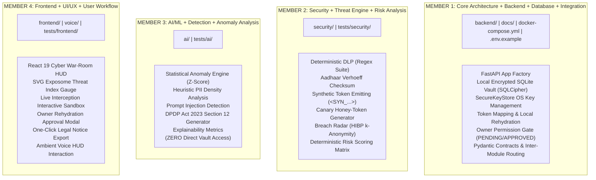
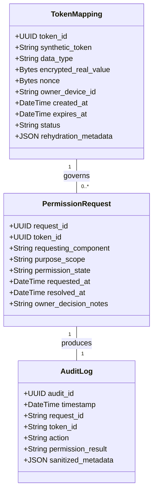
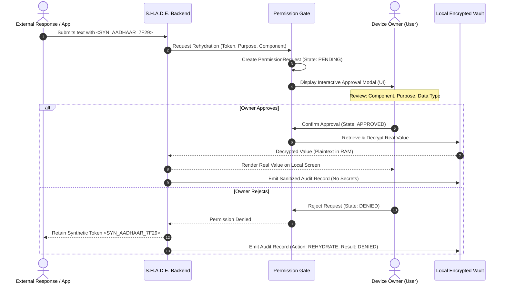
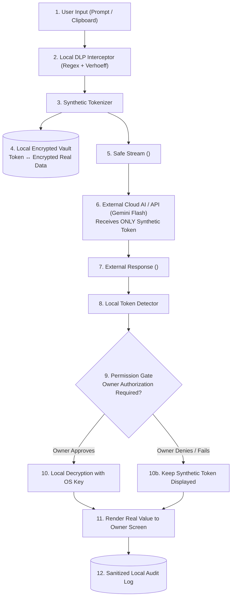

# S.H.A.D.E. — Repository Architecture & Module Ownership Specification
**Synthetic Host for Anonymization, Detection & Enforcement**  
*Document Version: 2.0.0 | Status: LOCAL-FIRST PRIVACY BLUEPRINT | Date: October 2026*  
*Repository: Shashank-1920/KPRIET-HackITon26 | Workstream: Member 1 (Core Architecture + Backend + Database + Integration)*

---

## 1. Core Architecture Philosophy: Local-First & Privacy-First

S.H.A.D.E. is fundamentally a **local-first, privacy-first, device-local, security-first** personal security operations center.

### Core Architectural Axiom: Real Sensitive Data Stays Local
1. **Device-Authoritative**: The owner's physical host machine is the sole authoritative repository for real sensitive data (Aadhaar, PAN, passwords, keys) and cryptographic token mappings. S.H.A.D.E. is **not** a cloud database application.
2. **Local Encrypted Vault**: Sensitive data is persisted locally using an encrypted SQLite database architecture (e.g., SQLCipher / SQLCipher-compatible encrypted SQLite). Unencrypted SQLite or plaintext storage is strictly prohibited.
3. **Secure Key Management Boundary**: The database encryption key is managed outside the database file via a platform abstraction (`SecureKeyStore`) that interfaces with OS-level credential vaults (Windows DPAPI / Credential Manager, macOS Keychain, Linux Secret Service).
4. **Synthetic Tokenization**: External services and cloud LLMs receive **only** synthetic placeholders (e.g., `<SYN_AADHAAR_7F29>`). The mapping required to rehydrate synthetic tokens is maintained exclusively on the owner's device.
5. **Owner Authorization & Local Rehydration**: Rehydrating a synthetic token back into a real value requires explicit owner consent via an interactive permission gate. External services are never permitted to rehydrate real sensitive values.

---

## 2. Complete Repository Tree

```
KPRIET-HackITon26/
│
├── backend/                               ← MEMBER 1: Core Architecture + Backend + Local Vault
│   ├── api/                               # FastAPI routing & endpoint registration
│   │   ├── routes/                        # Versioned routes (v1 core, auth, permissions)
│   │   └── dependencies/                  # Auth guards, permission checks, DB injection
│   ├── core/                              # App configuration, security settings, logging
│   ├── database/                          # Local encrypted database manager & sessions
│   │   ├── encrypted_sqlite.py            # SQLCipher engine & cipher configuration
│   │   ├── connection.py                  # Local SQLite connection lifecycle
│   │   └── session.py                     # Async session context managers
│   ├── keystore/                          # Platform SecureKeyStore abstraction
│   │   ├── base.py                        # Abstract KeyStore interface
│   │   └── platform_store.py              # OS Keychain / DPAPI / Secret Service adapters
│   ├── models/                            # SQLAlchemy ORM declarative models
│   │   ├── token_mapping.py               # Synthetic token ↔ encrypted real data entity
│   │   ├── permission_request.py          # Owner authorization & consent state entity
│   │   └── audit_log.py                   # Tamper-evident sanitized audit log entity
│   ├── schemas/                           # Pydantic v2 data contracts & validation
│   ├── services/                          # Rehydration & service orchestration layer
│   ├── security/                          # Ingress security middleware & token handlers
│   ├── main.py                            # ASGI application factory & lifecycle events
│   └── README.md                          # Member 1 ownership guide & rules
│
├── security/                              ← MEMBER 2: Security + Threat Engine + Risk Analysis
│   ├── dlp/                               # Deterministic Data Loss Prevention engine
│   │   ├── detectors/                     # Aadhaar, PAN, API key, password detectors
│   │   ├── patterns/                      # Compiled regex suites & format specifications
│   │   ├── masking/                       # Display redaction & privacy formatters
│   │   └── tokenizer/                     # Synthetic placeholder generator (<SYN_AADHAAR_xxxx>)
│   ├── validators/                        # Mathematical document validators
│   │   └── verhoeff/                      # Dihedral D5 Verhoeff checksum algorithm
│   ├── threat_engine/                     # Breach correlation, threat rules, honeytokens
│   ├── risk_engine/                       # Centralized 0-100 Exposome Threat Index calculator
│   ├── breach_radar/                      # Privacy-preserving HIBP k-anonymity client (SHA-1)
│   ├── decoy_engine/                      # Canary honeytoken generator for leak attribution
│   └── README.md                          # Member 2 ownership guide & rules
│
├── ai/                                    ← MEMBER 3: AI/ML + Detection + Anomaly Analysis
│   ├── anomaly/                           # Statistical outlier & anomalous behavior scoring
│   ├── heuristics/                        # Explainable heuristic filters (Z-score, PII density)
│   ├── models/                            # Scikit-learn models & inference handlers (if required)
│   ├── analysis/                          # Behavioral evaluation & classification pipelines
│   ├── legal/                             # DPDP Act 2023 Section 12 legal notice generator
│   ├── templates/                         # Statutory notice markdown templates
│   └── README.md                          # Member 3 ownership guide & rules
│
├── frontend/                              ← MEMBER 4: Frontend + UI/UX + User Workflow
│   ├── src/                               # React 19 application source
│   │   ├── components/                    # UI components (ThreatMeter, Sandbox, PermissionModal)
│   │   ├── pages/                         # Route views (Dashboard, Sandbox, Takedown, Settings)
│   │   ├── services/                      # API client integration (communicates via /api/v1)
│   │   ├── hooks/                         # React hooks for state and live streaming
│   │   └── utils/                         # Formatting utilities & visual helpers
│   ├── public/                            # Static assets, icons, audio cues
│   ├── package.json                       # Node dependencies & Vite configuration
│   └── README.md                          # Member 4 ownership guide & rules
│
├── voice/                                 ← PLANNED AUDIO MODULE (Shared / Member 4)
│   ├── wakeword/                          # Offline Porcupine "Hey Shade" listener
│   ├── stt/                               # Offline Vosk speech-to-text engine
│   ├── tts/                               # Offline Pyttsx3 speech synthesizer
│   └── README.md                          # Voice module interface & hardware failover guide
│
├── tests/                                 ← TEST SUITE (All Members)
│   ├── backend/                           # Member 1: API, Local Vault, and KeyStore tests
│   ├── security/                          # Member 2: Verhoeff, DLP regex, HIBP tests
│   ├── ai/                                # Member 3: Anomaly scoring & legal notice tests
│   ├── frontend/                          # Member 4: Component & workflow tests
│   └── integration/                       # Shared: End-to-end multi-module integration tests
│
├── docs/                                  ← ARCHITECTURE & DOCUMENTATION (Member 1)
│   └── architecture/
│       ├── ARCHITECTURE.md                # Master local-first system architecture
│       ├── REPOSITORY_STRUCTURE.md         # Repository structure & module ownership (this file)
│       └── diagrams/                      # System diagrams (SVG, Mermaid, data flow)
│
├── scripts/                               ← UTILITY & REPOSITORY SCRIPTS (Shared)
│   ├── dev_setup.ps1                      # Local development bootstrapping script
│   └── seed_demo_data.py                  # Offline demo breach & broker seed dataset
│
├── .env.example                           # Template environment configuration (No secrets)
├── .gitignore                             # Git exclusion rules (Secrets, caches, dependencies)
├── docker-compose.yml                     # Multi-container local deployment configuration
└── README.md                              # Project landing page, setup guide, and team rules
```

---

## 3. Purpose of Every Major Folder

| Directory | Primary Purpose | Primary Tech Stack |
| :--- | :--- | :--- |
| `backend/` | API gateway, local encrypted SQLite database, `SecureKeyStore` abstraction, owner permission gate, token rehydration. | Python 3.12+, FastAPI, Uvicorn, SQLCipher / SQLite, SQLAlchemy 2.x, Pydantic v2 |
| `security/` | Deterministic DLP interception, Verhoeff checksums, Canary honeytokens, HIBP k-anonymity client, 0–100 Exposome Threat Index. | Python standard library (`re`, `hashlib`, `secrets`), `cryptography` |
| `ai/` | Explainable statistical anomaly detection, Z-score analysis, DPDP Act Section 12 legal notice synthesis (strictly on masked payloads). | Python heuristics, Scikit-learn (if justified), Gemini Flash / Ollama |
| `frontend/` | Cyber War-Room HUD, SVG Threat Index gauge, live DLP sandbox, owner permission approval modal, takedown generator. | React 19, Vite, Vanilla CSS, Lucide React |
| `voice/` | Hands-free audio interaction, offline wake-word listener, local TTS status briefings. | Picovoice Porcupine, Vosk, Pyttsx3 |
| `tests/` | Unit, integration, security fuzzing, and adversarial test suites. | Pytest, pytest-asyncio, HTTPX AsyncClient, Vitest |
| `docs/` | Comprehensive architectural blueprints, threat modeling, API contract definitions. | Markdown, Mermaid, SVG |
| `scripts/` | Local environment bootstrapping, database seeding, test dataset generation. | PowerShell, Python |

---

## 4. Team Ownership & Responsibilities



---

## 5. Primary Local Data Vault Architecture

### 5.1 Local Embedded Database (SQLCipher / Encrypted SQLite)
S.H.A.D.E. abandons the traditional cloud-database paradigm. The authoritative data store is a **device-local, encrypted SQLite database**:
- **Encryption Engine**: SQLCipher or an established encrypted SQLite implementation.
- **No Plaintext Storage**: Plaintext sensitive values (Aadhaar, PAN, passwords) are **never** stored in an unencrypted database file.
- **Zero Cloud Persistence**: Sensitive identity records are never synchronized to external servers or cloud databases.

### 5.2 Cryptographic Key Storage Boundary (`SecureKeyStore`)
The database encryption key is decoupled from the database file itself. S.H.A.D.E. defines a platform-agnostic abstraction:

```
Platform Secure Storage (OS Level)
       │
       ▼
SecureKeyStore Abstraction:
  • Windows: DPAPI / Windows Credential Manager
  • macOS: Keychain Services
  • Linux: Secret Service API / libsecret
  • Dev / Container: High-entropy environment passphrase
       │
       ▼
Local Database Encryption Key (in RAM only)
       │
       ▼
Local Encrypted SQLite Database (.db)
```

---

## 6. Synthetic Token ↔ Encrypted Real Data Mapping



### Mapping Attributes:
- `synthetic_token`: The safe token sent to external services (e.g., `<SYN_AADHAAR_7F29>`).
- `data_type`: Identifier category (`AADHAAR`, `PAN`, `API_KEY`, `PASSWORD`).
- `encrypted_real_value`: Authenticated ciphertext encrypted with the master key.
- `status`: Lifecycle state (`ACTIVE`, `REVOKED`, `EXPIRED`).

---

## 7. Permission Gate & Owner Authorization

Access to real sensitive data requires explicit owner consent. Synthetic data may flow to external services, but rehydration to real data is strictly guarded:



### Permission States:
- `PENDING`: Request received; awaiting owner decision.
- `APPROVED`: Owner granted one-time, time-limited access.
- `DENIED`: Owner rejected request; synthetic token remains untouched.
- `EXPIRED`: Request timed out without owner interaction (fails closed).
- `REVOKED`: Previously granted access terminated by owner.

---

## 8. External Data Flow: Real Data Stays Local



---

## 9. External AI Security & Isolation

External AI providers (such as Google Gemini 2.5 Flash) are strictly isolated:
1. **Synthetic-Only Input**: Outbound prompts sent to external AI contain **only** synthetic placeholders (`<SYN_AADHAAR_7F29>`). Real Aadhaar, PAN, and credentials never cross the network boundary.
2. **Zero Vault Access**: External AI models have **zero direct access** to the local database, encryption keys, or secure keystores.
3. **Local Legal Generation**: DPDP Act Section 12 legal notices are synthesized using masked violation metadata, ensuring statutory requisitions are compiled without disclosing credentials to cloud servers.

---

## 10. Breach Radar (HIBP k-Anonymity Standard)

HaveIBeenPwned Passwords API v3 is utilized exclusively for password exposure lookups:
- **Hashing**: Local SHA-1 hash is computed locally: `hashlib.sha1(password.encode()).hexdigest().upper()`.
- **k-Anonymity**: Only the first 5 characters are dispatched to `https://api.pwnedpasswords.com/range/{prefix}`.
- **Local Matching**: Suffix matching is performed in memory on the local machine.
- **Prohibition**: HIBP is **never** used as a general identity database. Raw passwords, Aadhaar, PAN, or personal identities are **never** transmitted.

---

## 11. Status of PostgreSQL and Redis

### PostgreSQL: Optional / Future Infrastructure
- **Core Role**: **Removed from the primary data vault architecture.**
- **Classification**: Optional / Future enterprise sync infrastructure. If a future centralized telemetry component requires PostgreSQL, it serves purely as an optional, secondary sync target and **never** stores plaintext user data.

### Redis: Optional Ephemeral Security State
- **Core Role**: **Optional ephemeral cache.**
- **Classification**: Used only for short-lived rate-limiting counters and replay tokens when available. S.H.A.D.E. defaults to an in-memory sliding-window counter for 100% standalone, zero-dependency local execution.

---

## 12. Security Boundary & Data Classification Hierarchy

```
┌─────────────────────────────────────────────────────────────┐
│ LEVEL 1: HIGHEST PROTECTION — KEYS & PASSWORDS               │
│ • Database Encryption Keys, Master AES-GCM Key, JWT Secret  │
│ • Stored in OS Keychain (DPAPI / Keychain / Secret Service)  │
├─────────────────────────────────────────────────────────────┤
│ LEVEL 2: HIGH PROTECTION — ENCRYPTED REAL DATA              │
│ • Real Aadhaar, PAN, Credentials, Session Secrets           │
│ • Encrypted at rest in Local SQLite via SQLCipher           │
│ • Accessible ONLY via explicit owner permission             │
├─────────────────────────────────────────────────────────────┤
│ LEVEL 3: MEDIUM PROTECTION — PERMISSION & AUDIT METADATA     │
│ • Permission state records, request IDs, component labels   │
│ • Sanitized audit logs (strictly redacting raw secrets)     │
├─────────────────────────────────────────────────────────────┤
│ LEVEL 4: CONTROLLED EXPOSURE — SYNTHETIC DATA               │
│ • <SYN_AADHAAR_7F29>, <SYN_PAN_8812>, Synthetic emails      │
│ • Transmitted to external AI and third-party fiduciaries    │
└─────────────────────────────────────────────────────────────┘
```

---

## 13. Audit Logging Standards

Every rehydration request, token generation, and DLP event is logged to the local audit store:
- **Recorded Fields**: `request_id`, `token_id`, `requesting_component`, `timestamp`, `action`, `permission_result`, `purpose`.
- **Prohibited Fields**: **Never** store plaintext Aadhaar numbers, PAN cards, passwords, or cryptographic keys in audit logs.
- **Example**:
  - `GOOD`: `{"token_id": "SYN_AADHAAR_7F29", "action": "REHYDRATE", "result": "APPROVED", "component": "web_sandbox"}`
  - `BAD`: `{"aadhaar": "266853339452", "action": "REHYDRATE"}`

---

## 14. Git Workflow & Collaboration Rules

### Branch Architecture
```
main (Stable Integrated Trunk)
├── member-1/backend     ← Member 1: Core Architecture + Local Vault + Integration
├── member-2/security    ← Member 2: Security + Threat Engine + Risk Analysis
├── member-3/ai          ← Member 3: AI/ML + Detection + Anomaly Analysis
└── member-4/frontend    ← Member 4: Frontend + UI/UX + User Workflow
```

### Git Collaboration Standards:
1. **Never Push Directly to `main`**: Develop and commit exclusively on member branches.
2. **Never Force Push (`git push --force`)**: Protect shared repository history.
3. **Atomic Commits**: Conventional commits (`feat: ...`, `fix: ...`, `test: ...`, `docs: ...`).
4. **Pre-Commit Verification**: Run `git status` and `git diff` before committing to avoid staging unintended files.
